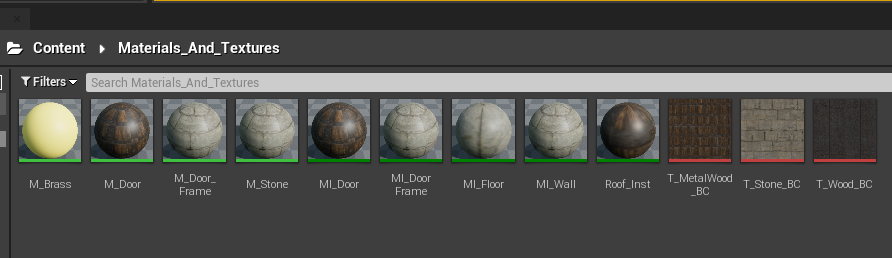
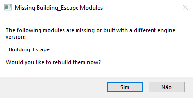

# Estudando Unreal Engine 5

# Sobre

Unreal Engine é um motor de jogo desenvolvido pela Epic Games, usado pela primeira vez em 1998 no jogo de tiro em primeira pessoa Unreal, ele tem sido a base de muitos jogos desde então. Embora usado inicialmente para jogos de tiro em primeira pessoa, ele tem sido usado com sucesso em uma grande variedade de gêneros de jogos.

Seu núcleo é escrito em C++, possibilitando a portabilidade. Suporta múltiplas plataformas, incluindo Microsoft Windows, Linux, Mac OS e Mac OS X em computadores pessoais, e os consoles Dreamcast, GameCube, Nintendo Switch, PlayStation 2, PlayStation 3, PlayStation 4, PlayStation 5, Stadia, Wii, Wii U, Xbox, Xbox 360, Xbox One e Xbox Series X.

# Cursos
## [Unreal Engine C++ The Ultimate Shooter Course](/the-ultimate-shooter-course.md)

# Recursos Importantes

## Links

- [Textures.com](https://www.textures.com/library) - Site pra obter texturas

# Conceitos e Utilidades Importantes

## Padronização

- Variáveis em CamelCase. Ex.: `int UmaVariavel = 10;`
- Variáveis booleanas começam com b. Ex.: `bool bGameOver = false;`

## Convenção para nomear os recursos

<div align='center'>
  
</div>

## Diretorio de recursos
### Mapas

| | |
--- | ---
Content\Maps | parent maps folder
............ Maps\Episode(_Number) | game episodes, where (_Number) is 01, 02, 03, etc
............ Maps\TestMaps | test maps, maps prototypes and other levels not for production

### Recursos

| | |
--- | ---
Content\Base | basic materials, material functions and other “foundation” assets
Content\Characters | folder for characters
............ Characters\NPC | NPCs
............ Characters\Player | player character(s)
Content\Dev | development assets, like objects icons, special meshes and textures, etc
Content\Effects | various shared effects
Content\Environment | environment assets
............ Environment\Background | backgrounds
............ Environment\Buildings | buildings (simple or procedural)
............ Environment\Foliage | foliage
............ Environment\Props | various props
............ Environment\Sky | skies
............ Environment\Landscape | terrains assets
............ Environment\Water | water meshes and materials
Content\Gameplay | assets for various gameplay purposes
Content\PostProcess | post process chains and it’s assets
Content\Sound | sounds and sound cues
Content\UI | UI assets
Content\Vehicles | vehicles with effects
Content\Weapons | weapons with effects

## Diretorios por Categoria

| | |
--- | ---
Blueprints | blueprints
Meshes | static and skeletal meshes, physical assets
Materials | materials and instances
Textures | textures
Animations | animations
Particles | particle systems
LensFlares | flares
Sounds | sounds + cues
Morphs | morphs
FaceFX | FaceFX assets

## Nomeação dos recursos
Form: (Prefixo_)NomeRecurso(_Numero)(_Sufixo)

Example: T_Rock_01_D

### Prefixos
Por uso:

| | |
--- | ---
CH_ | Characters
UI_ | User Interface
VH_ | Vehicles
WP_ | Weapons

Por tipo:

| | | | |
--- | --- | --- | ---
BP_ | Blueprint | SK_ | Skeletal Mesh
SM_ | Static Mesh | AD_ | Apex Destructible Asset
AC_ | Apex Cloth Asset | MT_ | Morph Target
ST_ | Speed Tree | PS_ | Particle System
LF_ | Lens Flare | VF_ | Vector Field
S_ | Sound | SC_ | Sound Cue
M_ | Material | MI_ | Material Instance
MITV_ | Material Instance Time Varying | MF_ | Material Function
MPC_ | Material Parameter Collection | T_ | Texture
SP_ | Sprite | SS_ | Sprite Sheet
TC_ | Texture Cube | RT_ | Render Target
PM_ | Physical Material

### Sufixos
Textura:

| | | | |
--- | --- | --- | ---
_BC | Base color | _MT | Metallic
_S | Specular | _R | Roughness
_N | Normal | _DP | Displacement
_AO | Ambient Occlusion | _H | Height Map
_FM | Flow Map | _L | Light Map (fake)
_M | Mask

Meshs:

| | |
--- | ---
_Physics | physics assets (generated name)
_FaceFX | FaceFx assets

Animações:

| | |
--- | ---
_BlendSpace | blend space (generated name)
_AnimBlueprint | animation blueprint (generated name)

## Actor e Components

- Um Actor é um container que pode ter muitos Components
- Existem muitos tipos diferentes de Components

## Tipos C++ no Unreal
O Unreal tem seus próprios tipos.
<div align='center'>
  <table>
    <thead>
      <tr>
        <th>Tipo C++</th>
        <th>Tipo Unreal</th>
      </tr>
    <thead>
    <tbody>
      <tr><td>std::string</td><td>FString</td></tr>
      <tr><td>int</td><td>int32</td></tr>
      <tr><td>char</td><td>TCHAR</td></tr>
      <tr><td>[]</td><td>TArray< type ></td></tr>
    <tbody>
  </table>
</div>

### FString
No geral, deve se usar o macro `TEXT()` quando for usar variaveis em string. Se não for especificado, o padrão de codificação de caractere será o ANSI, no qual é muito limitado em relação ao suporte de caracteres. Qualquer literal ANSI passado para um FString deve ser convertido pra TCHAR (codificação unicode nativa), então é mais eficiente usar `TEXT()`.
```c++
FString Frase = TEXT("O rato roeu a roupa do rei de Roma");
```

Podemos usar a função `Printf` para formatar valores e adiciona-los em uma string.
```c++
int quantidade = 10;
FString::Printf(TEXT("Eu tenho %i maças"), quantidade); // Eu tenho 10 maças

FString palavra = TEXT("Mundo");
FString::Printf(TEXT("Olá %s"), *palavra); // Olá mundo

FString::Printf(TEXT("Olá %s, eu tenho %i maças"), *palavra, quantidade); // Olá mundo, eu tenho 10 maças
```
- `Len()` Retorna a quantidade de caracteres na string.

### TCHAR
```c++
const TCHAR HW[] = TEXT("BOLOS");
```

### TArray
- `Num()` Retorna a quantidade de elementos do array.
- `Add()` Adiciona um elemento no final do array.
- `Emplace()` Adiciona um elemento no final do array.
- `Remove()` Remove elementos.

```c++
const TArray<FString> Palavras = {
  TEXT("VERMELHO"),
  TEXT("VERDE"),
  TEXT("AZUL")
};
```

## Deletando uma classe
É preciso navegar até onde o projeto está localizado e excluir os arquivos manualmente. Eles ficam em `.../raiz_do_projeto/Source/NomeDoProjeto/`

Depois é necessário apagar o diretorio **Binaries** que fica em `.../raiz_do_projeto/Binaries`. Lembre-se de fechar o UnrealEngine antes.

Abra o UnrealEngine novamente e você devera ver a seguinte mensagem, no qual devera clicar em sim, depois de abrir seu projeto:

<div align='center'>
  
</div>

## Mensagens de Log
Podemos gerar mensagens de log em tempo de execução utilizando as classes de log do Unreal, através de:
```c++
UE_LOG(Categoria, Verbosidade, Mensagem)
```
No qual:
- Category: Onde o log será gerado, podendo ser `LogTemp` (Log temporário)
- Verbosity: Tipo de log, podendo ser `Warning`(Amarelo), `Error`(Vermelho), `Display`(Cinza).
- Mensagem: A mensagem a ser descrita no log.
Exemplo:
```c++
UE_LOG(LogTempo, Warning, TEXT("Uma mensagem de LOG"));
```

