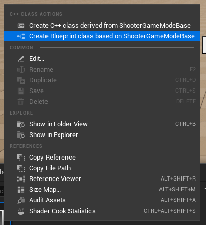
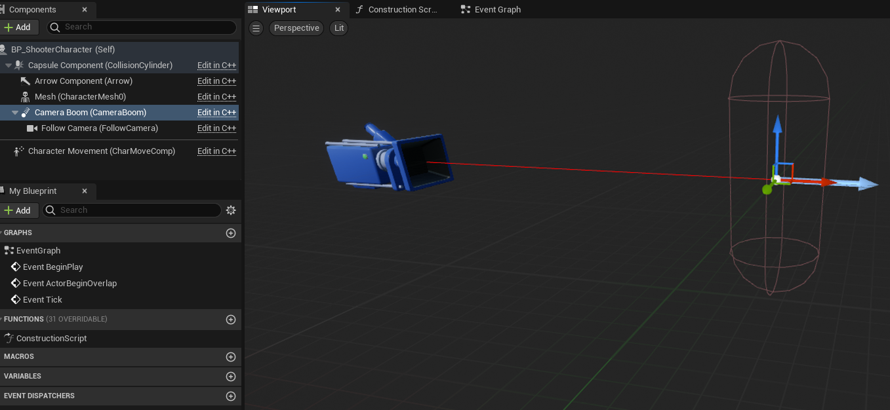
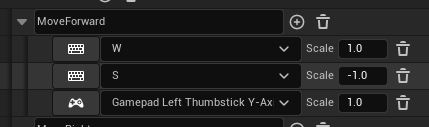

# Unreal Engine C++ The Ultimate Shooter Course

# Project Setup

...

## Criando e configurando o projeto

Primeiramente vamos criar um projeto, indo em "Games" e depois selecionando "Blank", e selecionando as seguintes configurações:
- C++ selecionado
- Target Platform: Desktop
- Quality Preset: Máximo
- Starter Content: desmarcado
- Raytracing: desmarcado

<div align='center'>
  
</div>

## Organizando os diretorios do projeto

Com o projeto criado, podemos começar criando alguns diretorios para organizar nossos arquivos. Apertando `ctrl + espaço` irá aparecer o "Content Drawer". Clicando no diretorio "Content", com o botão direito vamos criar alguns diretorios:
- "_Game": responsavel por armazenar todos os arquivos relacionados ao nosso jogo. Dentro de games:
  - "Maps"
  - "Character"
  - "GameMode"

## Definindo o Level padrão

Após isso, podemos salvar nosso "Level" atual. Para isso vamos em `File > Save Current Level`, e então selecioanamos o diretorio `_Game/Maps`, nomenado ele de "DefaultMap".

Para garantir que esse "Level" seja carregado toda vez que abrirmos nosso projeto, temos que definir ele como principal. Para isso vamos em `Edit > Project Settings`, e na janela que abriu, na guia lateral "Maps & Modes", podemos selecionar o level que criamos.

<div align='center'>
  
</div>

## Criando o GameMode padrão

Em seguida podemos seguir criando a classe para nosso gamemode que é responsavel por varios recursos globais do jogo como posição inicial do jogador, camera inicial do jogador, etc. Para isso vamos no diretorio `C++ Classes` e com o botão direito na classe "ShooterGameModeBase" selecionamos "Create Blueprint class based on ShooterGameModeBase". Colocamos o nome de "BP_ShooterGameModeBase" e salvamos em `_Game/GameMode`.

<div align='center'>
  
</div>

Com isso será aberto a janela de edição do blueprint com diversas configurações a serem feitas.

<div align='center'>
  
</div>

Para definir esse "GameMode" como padrão, temos que definir ele em:


## Criando a classe Character e seu Blueprint

Com nosso projeto criado e configurado podemos seguir para criação da classe do nosso personagem, começando pela criação de uma nova classe C++. Para isso vamos em `C++ Classes/Shooter`, e com o botão direito clicamos em "New C++ Class".


E então escolheremos "Character".


Vamos colocar o nome de ShooterCharacter e então clicar em "Create Class". Feito isso, nosso editor irá abrir com o conteudo atual de nossa nova classe em dois arquivos `ShooterCharacter.h` e `ShooterCharacter.cpp`.

Depois de criada nossa classe, vamos criar um Blueprint baseado na nossa classe, indo no "Content Drawer" em `C++ Classes/Shooter` e com o botão direito na nosssa classe clicar em "Create Blueprint class based on ShooterCharacter", colocando o nome de BP_ShooterCharacter.


Depois de criada, podemos ver que nosso blueprint possui alguns componentes. Componentes são um tipo especial de Objeto que os Atores podem anexar a si mesmos como subobjetos. Os componentes são úteis para compartilhar comportamentos comuns, como a capacidade de exibir uma representação visual, reproduzir sons. Eles também podem representar conceitos específicos do projeto, como a maneira como um veículo interpreta a entrada e altera sua própria velocidade e orientação. Por exemplo, um projeto com carros, aeronaves e barcos controláveis pelo usuário pode implementar as diferenças no controle e movimento do veículo alterando qual Componente um Ator do veículo usa.


Temos:
- CapsuleComponent: Geralmente usada para gerenciar a colisão do personagem;
- ArrowComponent: Geralmente usado pra indicar a direção para onde o personagem está olhando;
- Mesh: Usado para guardar o modelo 3D do personagem;
- CharacterComponent: Responsavel por abstrair varios comportamentos comuns de personagens como pular, andar, etc.

## Definindo o Character criado como Pawn padrão

Para definir o character como pawn padrão, temos que ir no blueprint de nosso gamemode, e então esolher em "Default Pawn Class" a classe do nosso character.


Depois se dermos "Play", podemos ver o objeto de nosso Character criado.


## Exibindo mensagens no LOG do Unreal

Podemos exibir mensagens no OutputLog do Unreal através de da função `UE_LOG(CategoryName, Verbosity, Text)`, onde podemos passar alguns parametros. São eles:

- CategoryName: Onde o log vai ser exibido. Pode ser: `LogTemp`;
- Verbosity: Tipo de log. Pode ser: `Display`, `Warning` ou `Error`;
- Text: Texto a ser exibido. Precisa usar o macro `TEXT("")`;

```c++
// Para imprimir inteiros temos que passar o TEXT com formato de inteiro
UE_LOG(LogTemp, Warning, TEXT("Some Text"));

// Para imprimir FString temos que passar operador de sobrecarga *
UE_LOG(LogTemp, Warning, TEXT("Some String: %s", *someFString)); para retornar um array de TCHAR

// Para imprimir inteiros temos que passar o TEXT com formato de inteiro
UE_LOG(LogTemp, Warning, TEXT("Some Integer: %d"), 2);

// Para imprimir pontos flutuantes temos que passar o TEXT com formato de ponto flutuante
UE_LOG(LogTemp, Warning, TEXT("Some float: %f"), 2.5f);

// Para imprimir double temos que passar o TEXT com formato de double
UE_LOG(LogTemp, Warning, TEXT("Some double: %lf"), 2.5);

// Para imprimir char temos que passar o TEXT com formato de char
UE_LOG(LogTemp, Warning, TEXT("Some char: %c"), 'c');

//Para imprimir wide char temos que passar o TEXT com formato de wide char
UE_LOG(LogTemp, Warning, TEXT("Some wide char: %lc"), L'J');

//Para imprimir bool temos que passar o TEXT com formato de integer
UE_LOG(LogTemp, Warning, TEXT("Some bool: %d"), true);
```

## Criando o "braço" pra segurar a camera do personagem

Para a camera do personagem vamos precisar do "Spring Arm Component". Vamos criar ele na nossa classe ShooterCharacter, indo no arquivo de cabeçalho `ShooterCharacter.h`.

> ShooterCharacter.h
```c++
...
private:
	/* Camera boom positioning the camera behind the character */
	UPROPERTY(VisibleAnywhere, BlueprintReadOnly, Category = Camera, meta = (AllowPrivateAccess = "true"))
	class USpringArmComponent* CameraBoom;

public:
	/* Return CameraBoom subobject */
	FORCEINLINE USpringArmComponent* GetCameraBoom() const { return CameraBoom; };
...
```

Observações:

  1) O `class` antes do nome da classe é usado para não precisarmos definir no header a classe `ShooterCharacter`, dizendo ao compilador que está classe existe, não gerando erros de compilação, precisando somente declarar no arquivo de declaração da classe.

  2) O `FORCEINLINE` diz ao compilador para substituir toda chamada de `GetCameraBoom` pelo conteúdo na mesma.

  3) O `UPROPERTY` é usado para expormos parametros para o editor de blueprint ([mais detalhes](https://docs.unrealengine.com/4.27/en-US/ProgrammingAndScripting/GameplayArchitecture/Properties/)):
  -

E no nosso arquivo fonte, após incluirmos o cabeçalho `GameFramework/SpringArmComponent.h`, inicializamos o objeto através do metódo `USpringArmComponent` onde passamos a tipo do componente que vamos criar seguido pela identificação do mesmo naquela classe. Agora precisamos definir que esse componente faça parte do ator atrelando o mesmo ao "RootComponent".

> ShooterCharacter.cpp
```c++
#include "GameFramework/SpringArmComponent.h"

AShooterCharacter::AShooterCharacter()
{
	PrimaryActorTick.bCanEverTick = true;

	// Create the camera boom (pulls in towards the character if there is a collision)
	CameraBoom = CreateDefaultSubobject<USpringArmComponent>(TEXT("CameraBoom"));
	CameraBoom->SetupAttachment(RootComponent);
	CameraBoom->TargetArmLength = 300.f; // the camera follow at this distance behind the character
	CameraBoom->bUsePawnControlRotation = true; // rotate the arm based on the controller
}
```

Observações:

  1) `CameraBoom->TargetArmLength = 300.f;` serve pra definir a distancia entre a camera e o personagem.

  2) `CameraBoom->bUsePawnControlRotation = true;` serve pra indicar que o controle da rotação do personagem, também afetara a camera.

## Criando a camera para posicionar no "braço"

Vamos começar declarando ela:

> ShooterCharacter.h
```c++
private:
  ...
  /* Camera that follows the characters */
	UPROPERTY(VisibleAnywhere, BlueprintReadOnly, Category = Camera, meta = (AllowPrivateAccess = "true"))
	class UCameraComponent* FollowCamera;
  ...

public:
  ...
  /* Return FollowCamera subobject */
	FORCEINLINE UCameraComponent* GetFollowCamera() const { return FollowCamera; };
  ...
```

> ShooterCharacter.cpp
```c++
#include "Camera/CameraComponent.h"

AShooterCharacter::AShooterCharacter()
{
  ...
  // Create a follow camera
	FollowCamera = CreateDefaultSubobject<UCameraComponent>(TEXT("FollowCamera"));
	FollowCamera->SetupAttachment(CameraBoom, USpringArmComponent::SocketName); // attach camera to end of boom
	FollowCamera->bUsePawnControlRotation = false; // camera does not rotate relative to arm
}
```

Observações:
  1) `bUsePawnControlRotation` serve pra indicar se a camera se movera sozinha ou não, em relação ao controller.

Agora se compilarmos nossa solução veremos o componente da camera no blueprint do character.

<div align='center'></div>

## Controles e Entradas

<div align='center'></div>

## Move Forward and Right

Ao dar play em nosso projeto, se tentarmos andar não vamos conseguir. Isso porque ainda não definimos controles para o mesmo e nem implementamos funções de movimento.

Primeiramente vamos começar definindo algumas entradas em nosso projeto, indo em `Edit > Project Settings`. Depois vamos na aba "Input".

<div align='center'></div>

Existem dois tipos de entrada: "Action Mappings" e "Axis Mappgings". Eles fornecem um mecanismo para mapear convenientemente chaves e eixos para comportamentos de entrada, inserindo uma camada de indireção entre o comportamento de entrada e as teclas que o invocam.

Os Action Mappings são para pressionamentos e liberações de teclas, acionando eventos uma unica vez, enquanto os Axis Mappgings permitem entradas que têm uma faixa contínua, pois são checados a cada frame.

## Adicionando axis mapping

Para criar um axis mapping, clicamos no botão + e depois verificamos se sua seção não esta encolhida.

<div align='center'></div>

Vamos atribuir primeira a função MoveForward, que será responsavel por fazer o personagem andar pra frente ou pra trás. Colocamos então o nome MoveForward, adicionando três entradas, uma definindo W como 1.0 e outra definindo S como -1.0. A entrada Gamepad Left Thumbstick Y-axis é responsavel pelo mapeamento no joystick.

<div align='center'></div>

Depois atribuimos a função MoveRight, que será responsavel por fazer o personagem andar para os lados. Colocamos então o nome MoveRight, adicionando três entradas, uma definindo D como 1.0 e outra definindo A como -1.0. A entrada Gamepad Left Thumbstick X-axis é responsavel pelo mapeamento no joystick.

<div align='center'></div>

Ao final teremos as entradas assim:

<div align='center'></div>

## Criando funções para atribuir aos mappings

Depois de definido as entradas no projeto. Vamos criar alguns metodos para ligar a estas entradas.

> ShooterCharacter.h
```c++
protected:
  /** Called from forwards/backwards input */
	void MoveForward(float Value);

	/** Called from side to side input */
	void MoveRight(float Value);
```

> ShooterCharacter.cpp
```c++
void AShooterCharacter::MoveForward(float Value)
{
	if (Controller && Value != 0.0f)
	{
		// find out which way is forward
		const FRotator Rotation { Controller->GetControlRotation() };
		const FRotator YawRotation { 0, Rotation.Yaw, 0 };

    // find the direction the character is
		const FVector Direction { FRotationMatrix { YawRotation }.GetUnitAxis(EAxis::X) };

    // movement the character
		AddMovementInput(Direction, Value);
	}
}

void AShooterCharacter::MoveRight(float Value)
{
	if (Controller && Value != 0.0f)
	{
		// find out which way is right
		const FRotator Rotation { Controller->GetControlRotation() };
		const FRotator YawRotation { 0, Rotation.Yaw, 0 };

    // find the direction the character is
		const FVector Direction { FRotationMatrix { YawRotation }.GetUnitAxis(EAxis::Y) };

    // movement the character
		AddMovementInput(Direction, Value);
	}
}

...

void AShooterCharacter::SetupPlayerInputComponent(UInputComponent* PlayerInputComponent)
{
	Super::SetupPlayerInputComponent(PlayerInputComponent);

  // to check if PlayerInputComponent is valid
	check(PlayerInputComponent);

	PlayerInputComponent->BindAxis("MoveForward", this, &AShooterCharacter::MoveForward);
	PlayerInputComponent->BindAxis("MoveRight", this, &AShooterCharacter::MoveRight);

}
```

## Delta Time

- Delta Time é o tempo entre os frames.
- Um frame é uma única imagem atualizada na tela.
- Frame Rate é o número de frames atualizados na tela por segundo (FPS)
- Tick é sinonimo a frame

Sempre que possível, temos que fazer alguns calculos com relação ao Delta Time, para que este seja independente do frame rate.

## Rotacionando a camera com teclado e joystick

Primeiro, vamos atribuir alguns "inputs". Atribuimos a função TurnRate, que será responsavel por fazer o personagem olhar pra direita ou pra esquerda. Colocamos então o nome TurnRate, adicionando três entradas, uma definindo "Right" como 1.0 e outra definindo "Left" como -1.0. A entrada Gamepad Right Thumbstick X-axis é responsavel pelo mapeamento no joystick.

<div align='center'></div>

Depois atribuimos a função LookUpRate, que será responsavel por fazer o personagem olhar pra cima ou pra baixo. Colocamos então o nome LookUpRate, adicionando duas entradas, uma definindo "Up" como 1.0 e outra definindo "Down" como -1.0. A entrada Gamepad Right Thumbstick Y-axis é responsavel pelo mapeamento no joystick.

<div align='center'></div>

Ao final teremos as entradas assim:

<div align='center'></div>

Depois implementamos algumas funções que rotacionam o controller

> ShooterCharacter.h
```c++
protected:
...
  /**
  * Called via input to turn at a given rate
  * @param Rate This is a normalized rate, i.e. 1.0 means 100% of desired turn rate
  */
  void TurnAtRate(float Rate);

  /**
  * Called via input to look up/down at a given rate
  * @param Rate This is a normalized rate, i.e. 1.0 means 100% of desired turn rate
  */
  void LookUpAtRate(float Rate);
...
private:
  /** Base turn rate in deg/sec. Other scaling may affect final turn rate */
	UPROPERTY(VisibleAnywhere, BlueprintReadOnly, Category = Camera, meta = (AllowPrivateAccess = "true"))
	float BaseTurnRate;

	/** Base look up/down in deg/sec. Other scaling may affect final turn rate */
	UPROPERTY(VisibleAnywhere, BlueprintReadOnly, Category = Camera, meta = (AllowPrivateAccess = "true"))
	float BaseLookUpRate;
```

> ShooterCharacter.cpp
```c++
AShooterCharacter::AShooterCharacter() :
	BaseTurnRate(45.f),
	BaseLookUpRate(45.f)
{
 	...
}

...

void AShooterCharacter::TurnAtRate(float Rate)
{
	// calculate delta for this frame from the rate information
	AddControllerYawInput(Rate * BaseTurnRate * GetWorld()->GetDeltaSeconds()); // deg/sec * sec/frame
}

void AShooterCharacter::LookUpAtRate(float Rate)
{
	// calculate delta for this frame from the rate information
	AddControllerPitchInput(Rate * BaseLookUpRate * GetWorld()->GetDeltaSeconds()); // deg/sec * sec/frame
}

void AShooterCharacter::SetupPlayerInputComponent(UInputComponent* PlayerInputComponent)
{
  ...
	PlayerInputComponent->BindAxis("TurnRate", this, &AShooterCharacter::TurnAtRate);
	PlayerInputComponent->BindAxis("LookUpRate", this, &AShooterCharacter::LookUpAtRate);
}
```

## Rotacionando a camera com mouse e pulando

Primeiro, vamos atribuir alguns "inputs". Atribuimos a função Turn, que será responsavel por fazer o personagem olhar pra direita ou pra esquerda. Colocamos então o nome Turn, adicionando uma entrada, definindo "Mouse X".

<div align='center'></div>

Depois atribuimos a função LookUp, que será responsavel por fazer o personagem olhar pra cima ou pra baixo. Colocamos então o nome LookUp, adicionando uma entrada, definindo "Mouse Y"

<div align='center'></div>

Ao final teremos as entradas assim:

<div align='center'></div>

Depois implementamos algumas funções que rotacionam o controller

> ShooterCharacter.cpp
```c++
void AShooterCharacter::SetupPlayerInputComponent(UInputComponent* PlayerInputComponent)
{
	...
	PlayerInputComponent->BindAxis("Turn", this, &APawn::AddControllerYawInput);
	PlayerInputComponent->BindAxis("LookUp", this, &APawn::AddControllerPitchInput);
}
```

Para o pulo, temos que registrar o input em "Action Mappings". Definindo então o input "Jump". Com duas entradas, uma em "Gamepad Face Button Bottom" e outra em "Space bar".

<div align='center'></div>

Depois implementamos algumas funções que rotacionam o controller

> ShooterCharacter.cpp
```c++
void AShooterCharacter::SetupPlayerInputComponent(UInputComponent* PlayerInputComponent)
{
	...
	PlayerInputComponent->BindAction("Jump", IE_Pressed, this, &ACharacter::Jump);
	PlayerInputComponent->BindAction("Jump", IE_Released, this, &ACharacter::StopJumping);
}
```

## Adicionando um Mesh

Para este projeto, vamos utilizar os assets de "Paragon: Lt. Belica".

<div align='center'></div>

Depois de localizar na loja e adquirir, basta clicar em Adicionar ao projeto, selecionar o projeto e em seguida aguardar o download. Após o download, podemos ver o diretorio incluido no nosso projeto:

<div align='center'></div>

Pronto, agora é so adicionar o mesh ao nosso blueprint. Para isso vamos abrir o editor de blueprint de nosso `BP_ShooterCharacter`. Na esquerda selecionar o componente "Mesh".

<div align='center'></div>

Em seguida na direita, vamos na seção Mesh, e em Skeletal Mesh, selecionamos o Skeletal Mesh "Belica".

<div align='center'></div>

Depois de carregado, podemos ver o modelo no editor.

<div align='center'></div>

Note que ele está metade fora da capsula e rotacionado para o lado diferente do "ArrowComponent". Podemos ajustar isso presionando E e rotacionado pra ficar de acordo com o "ArrowComponent" e depois ajustar a posição para se adequar a capsula na direita, na seção "Transform", colocando o valor Z de Location proximo de -88.

<div align='center'></div>

Fazendo assim com que tudo fique adequado.

<div align='center'></div>

...

---

# Animations
# Aiming and Crosshairs
# The Weapon
# Item Interpolation
# Reloading
# Advanced Movement
# Ammo Pickups
# Outline and Glow Effects
# Multiple Weapon Types
# Footsteps
# Multiple Characters Meshs
# The Enemy Class
# AI and Behavior Trees
# Khaimera
# Level Creation and Finishing the Game

## Fontes
- https://www.udemy.com/course/unreal-engine-the-ultimate-shooter-course/
