# Animations

## A classe base AnimInstance

Depois de adicionar o modelo ao nosso blueprint, ele se mantem estatico. Isso porque ainda não temos uma animação definida. Para fazer isso primeiro temos que criar uma classe C++. Vamos em adicionar uma nova classe C++, e depois vamos na aba "All Classes", procuramos por "AnimInstance", e então selecionamos ela como classe base. Vamos nomear a classe de `ShooterAnimInstance`. E depois vamos definir algumas variaveis e funções para nossa nova classe.

```c++
// ShooterAnimInstance.h
...
public:
	UFUNCTION(BlueprintCallable)
	void UpdateAnimationProperties(float DeltaTime);

	virtual void NativeInitializeAnimation() override;

private:
	UPROPERTY(VisibleAnywhere, BlueprintReadOnly, Category = Movement, meta = (AllowPrivateAccess = "true"))
	class AShooterCharacter* ShooterCharacter;

  /** The speed of the character */
  UPROPERTY(VisibleAnywhere, BlueprintReadOnly, Category = Movement, meta = (AllowPrivateAccess = "true"))
  float Speed;

  /** Whether or not the character is in the air */
  UPROPERTY(VisibleAnywhere, BlueprintReadOnly, Category = Movement, meta = (AllowPrivateAccess = "true"))
  bool bIsInAir;

  /** Whether or not the character is moving */
  UPROPERTY(VisibleAnywhere, BlueprintReadOnly, Category = Movement, meta = (AllowPrivateAccess = "true"))
  bool bIsAccelerating;
```

```c++
// ShooterAnimInstance.cpp

#include "ShooterCharacter.h"
#include "GameFramework/CharacterMovementComponent.h"

void UShooterAnimInstance::UpdateAnimationProperties(float DeltaTime)
{
	if (ShooterCharacter)
	{
		ShooterCharacter = Cast<AShooterCharacter>(TryGetPawnOwner());
	}
  if (ShooterCharacter)
  {
    // get the lateral speed of the character from velocity
    FVector Velocity { ShooterCharacter->GetVelocity() };
    Velocity.Z = 0;
    Speed = Velocity.Size();

    // Is the character in the air?
    bIsInAir = ShooterCharacter->GetCharacterMovement()->IsFalling();

    // the character accelerating?
    if (ShooterCharacter->GetCharacterMovement()->GetCurrentAcceleration().Size() > 0.f)
    {
      bIsAccelerating = true;
    }
    else
    {
      bIsAccelerating = false;
    }
  }
}

void UShooterAnimInstance::NativeInitializeAnimation()
{
	Super::NativeInitializeAnimation();

	ShooterCharacter = Cast<AShooterCharacter>(TryGetPawnOwner());
}
```

## Criando o blueprint da animação baseado em nossa class

Agora depois de criarmos nossa classe pra animação, vamos criar um blueprint baseado na mesma. Para isso vamos no diretorio `Content/_Game/Character` e com o botão direito, vamos em "Animation" e depois em "Animation Blueprint".

<pre><div align='center'><p>Unreal Editor</p>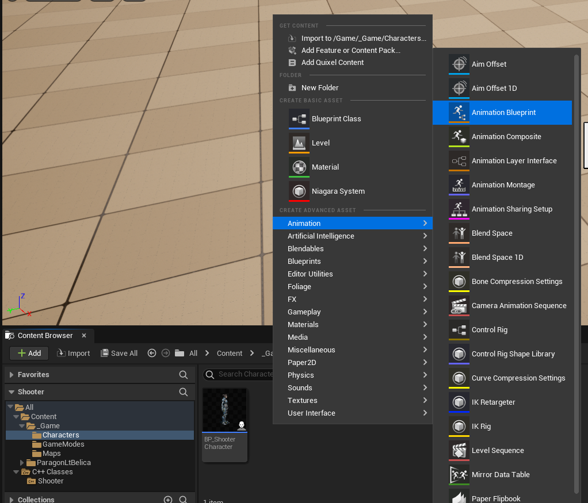</div></pre>

Então selecionamos como classe base nossa classe `ShooterAnimInstance` e selecionamos tambpem o esqueleto do modelo sendo o "Belica_Skeleton", e então clicamos em "Create".

<pre><div align='center'><p>Unreal Editor</p>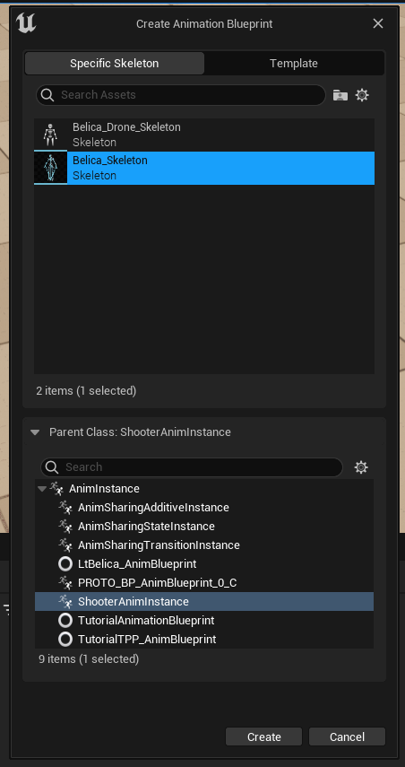</div></pre>

Podemos colocar o nome no blueprint de "BP_ShooterAnim".

Após, podemos associar esse blueprint de animação ao blueprint do nosso personagem indo em no blueprint do personagem, e a direita na seção "Animation" selecionamos "Animation Mode" como "Use Animation Blueprint", e em "Anim Class" escolhemos o blueprint de animação que acabamos de criar.

<pre><div align='center'><p>BP_ShooterAnimInstance</p>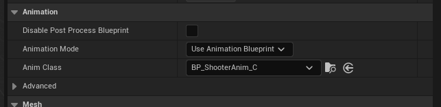</div></pre>

Depois disso compile o blueprint.

## Definindo as os estados de animações

Agora podemos abrir o blueprint da animação "BP_ShooterAnim". No editor de blueprint nós teremos o "Event Graph" onde poderemos colocar a lógica do blueprint e o "AnimGraph" que será responsavel pela lógica da animação e mudança de estados.

<pre><div align='center'><p>BP_ShooterAnimInstance > AnimGraph</p>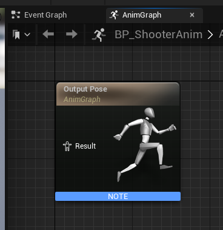</div></pre>

Começaremos chamando a função que criamos `UpdateAnimationProperties` no "Event Graph", ligando o "Event Blueprint Update Animation" a nossa função.

<pre><div align='center'><p>BP_ShooterAnimInstance > Event Graph</p>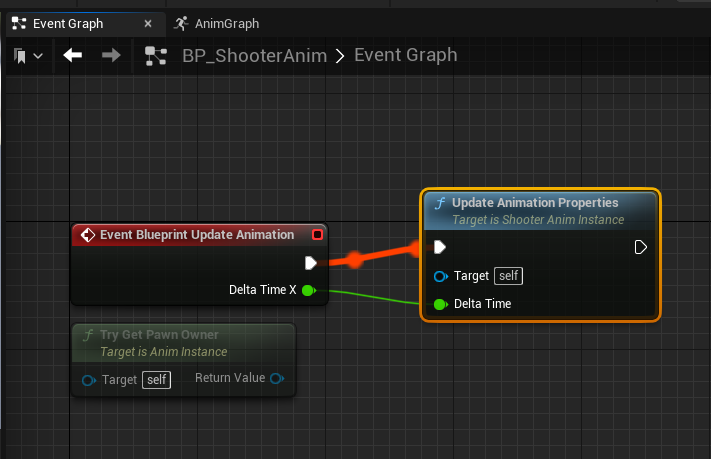</div></pre>

Agora podemos criar alguns "State Machines". Para isso no "AnimGraph" criaremos um estado através do "Add New State Machine".

<pre><div align='center'><p>BP_ShooterAnimInstance > AnimGraph</p>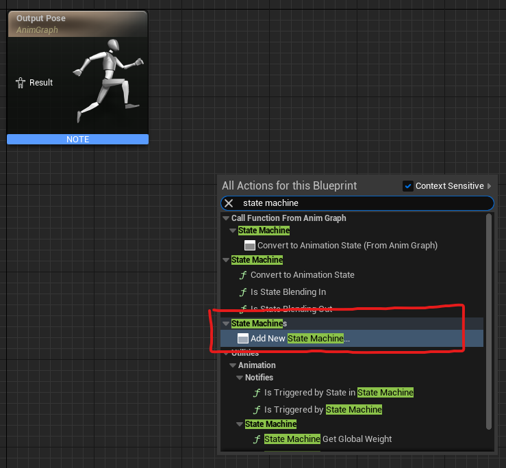</div></pre>

Depois de criar, vamos renomear para "Ground Locomotion" e ligá-lo ao nossa pose de saída ("Output Pose").

<pre><div align='center'><p>BP_ShooterAnimInstance > AnimGraph</p>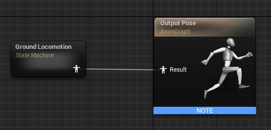</div></pre>

Agora a cada frame, cada retorno de Ground Locomotion irá alimentar a pose de saída fazendo assim a animação.

Vamos editar no estado clicando nele duas vezes.

<pre><div align='center'><p>BP_ShooterAnimInstance > AnimGraph > Ground Locomotion</p>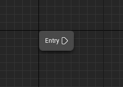</div></pre>

Vamos adicionar alguns estados a esse "Machine". Clicando na seta branca e arrastando para o lado, e depois escolhendo "Add State".

<pre><div align='center'><p>BP_ShooterAnimInstance > AnimGraph > Ground Locomotion</p>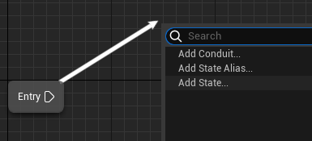</div></pre>

Chamaremos esse de "Idle".

<pre><div align='center'><p>BP_ShooterAnimInstance > AnimGraph > Ground Locomotion</p>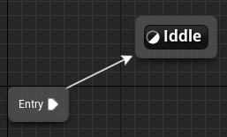</div></pre>

A partir daí criaremos outros estados.

- Idle: é a animação base de nosso personagem parado. A partir dela nosso personagem pode começar a se movimentar indo pro estado "JogStart";
- JogStart: é a animação que nosso personagem sai do ponto de parado para começar a se movimentar. A partir dela nosso personagem pode começar a correr no estado "Run". Ele também pode interromper a continução pra correr e tentar parar indo pro estado "JogStop";
- Run: é a animação de nosso personagem correndo. A partir dela nosso personagem pode começar a parar de correr então indo pro estado "JogStop";
- JogStop: é animação de nosso personagem parando de se movimentar. A partir dela ele pode parar totalmente voltando ao estado "Idle". Ele também pode voltar a se movimentar indo novamente pro estado "JogStart";

Ao final, nosso fluxo de estados ficara da seguinte forma:

<pre><div align='center'><p>BP_ShooterAnimInstance > AnimGraph > Ground Locomotion</p>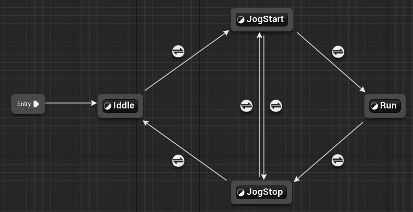</div></pre>

Agora podemos seguir adicionando animações a cada um dos estados assim como também adicionar as transições entre cada estado.

<pre><div align='center'><p>BP_ShooterAnimInstance > AnimGraph > Ground Locomotion</p>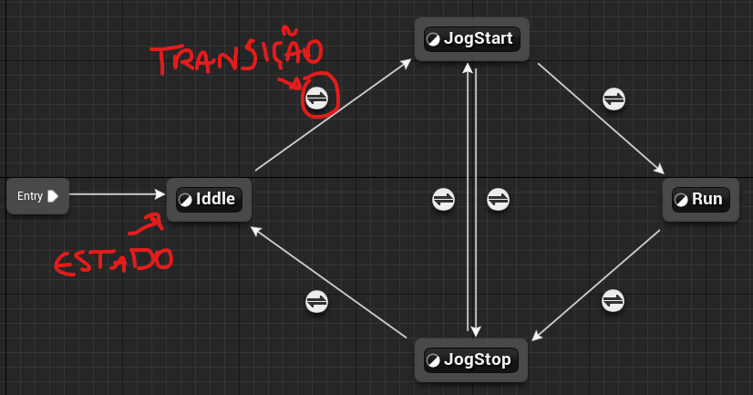</div></pre>

## Definindo as animações para os estados (Idle)

Vamos agora atribuir as animações aos estados. Vamos começar pelo estado "Idle", dando dois cliques no mesmo. Em seguida no na direita escolhemos a aba "Asset Browser", e procuramos pela animação "Idle Relaxed".

<pre><div align='center'><p>BP_ShooterAnimInstance > AnimGraph > Ground Locomotion > Idle (state)</p>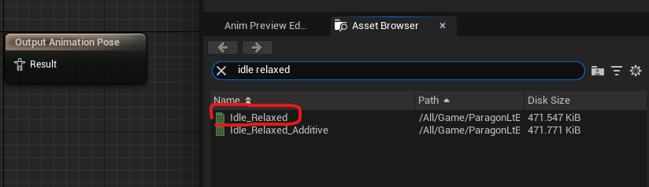</div></pre>

Arrastamos ela para nossa área e em seguida ligamos a pose de saída do estado atual.

<pre><div align='center'><p>BP_ShooterAnimInstance > AnimGraph > Ground Locomotion > Idle (state)</p>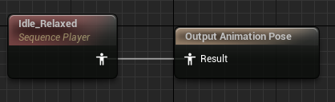</div></pre>

## Definindo as animações para os estados (JogStart)

Agora vamos atribuir a animação ao estado "JogStart". Repetindo todo o processo e escolhendo a animação "Jog_Fwd_Start" e associando a pose de saída atual.

<pre><div align='center'><p>BP_ShooterAnimInstance > AnimGraph > Ground Locomotion > JogStart (state)</p>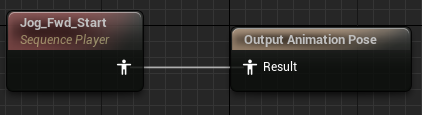</div></pre>

## Definindo as animações para os estados (Run)

Depois vamos atribuir a animação ao estado "Run". Repetindo todo o processo e escolhendo a animação "Jog_Fwd" e associando a pose de saída atual.

<pre><div align='center'><p>BP_ShooterAnimInstance > AnimGraph > Ground Locomotion > Run (state)</p>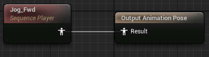</div></pre>

## Definindo as animações para os estados (JogStop)

Depois vamos atribuir a animação ao estado "JogStop". Repetindo todo o processo e escolhendo a animação "Jog_Fwd_Stop" e associando a pose de saída atual.

<pre><div align='center'><p>BP_ShooterAnimInstance > AnimGraph > Ground Locomotion > JogStop (state)</p>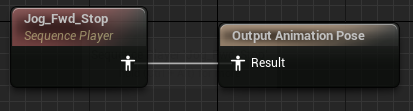</div></pre>

## Definindo as animações para as transições (Idle para JogStart)

Agora podemos seguir definindo as animações para as transições entre um estado e outro. Isso é importante pra criar um efeito suavizado durante a troca de estados.

Vamos começar pela transição entre "Idle" e "JogStart". Nós procuramos iniciar essa transição sempre que a velocidade for maior que zero. Para isso dê dois cliques na transição

<pre><div align='center'><p>BP_ShooterAnimInstance > AnimGraph > Ground Locomotion > Idle to JogStart (rule)</p>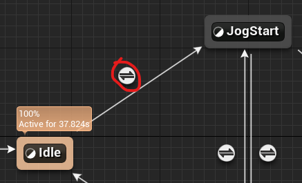</div></pre>

E então podemos adicionar nossa função "Get Speed".

<pre><div align='center'><p>BP_ShooterAnimInstance > AnimGraph > Ground Locomotion > Idle to JogStart (rule)</p>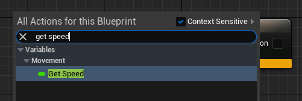</div></pre>

<pre><div align='center'><p>BP_ShooterAnimInstance > AnimGraph > Ground Locomotion > Idle to JogStart (rule)</p>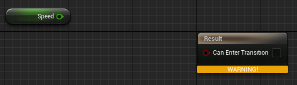</div></pre>

E então colocamos no nó de comparação "Greater"

<pre><div align='center'><p>BP_ShooterAnimInstance > AnimGraph > Ground Locomotion > Idle to JogStart (rule)</p>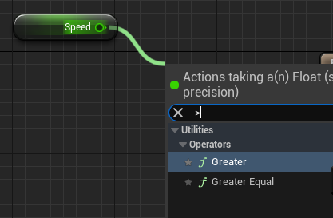</div></pre>

Depois verificamos se o personagem está no ar através da função "Get Is in Air", e depois adicionando um nó de negação "Not Boolean", e por fim colocamos nossa função "Get is Accelerating". Com isso temos então três condições:

<pre><div align='center'><p>BP_ShooterAnimInstance > AnimGraph > Ground Locomotion > Idle to JogStart (rule)</p>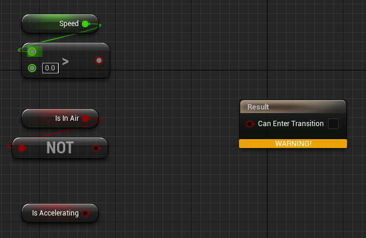</div></pre>

Vamos agora adicionar um nó condicional "And Boolean", e ligar nossas três condições, e depois ligar ao resultado. Ficara da seguinte forma:

<pre><div align='center'><p>BP_ShooterAnimInstance > AnimGraph > Ground Locomotion > Idle to JogStart (rule)</p></div></pre>

## Definindo as animações para as transições (JogStart para Run)

Para esta transição, queremos que ela seja automatica. Para isso iremos marcar na direita na seção "Transition" a opção "Automatic Rule Based on Sequence Player in State".

<pre><div align='center'><p>BP_ShooterAnimInstance > AnimGraph > Ground Locomotion > JogStart to Run (rule)</p>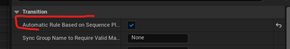</div></pre>

Isto será feito de acordo com a mistura das duas animações. Podemos ajustar esse nivel de mistura na seção "Blend Settings". Vamos definir nessa seção a opção "Duration" em 0.8.

## Definindo as animações para as transições (Run para JogStop)

A lógica ficara da seguinte forma utilizando "Get Speed" e "Not Boolean".

<pre><div align='center'><p>BP_ShooterAnimInstance > AnimGraph > Ground Locomotion > Run to JogStop (rule)</p>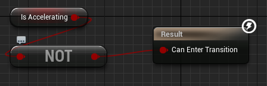</div></pre>

## Definindo as animações para as transições (JogStop para Idle)

Para esta transição, queremos que ela seja automatica. Para isso iremos marcar na direita na seção "Transition" a opção "Automatic Rule Based on Sequence Player in State", e definindo opção "Duration" em 0.4.

<pre><div align='center'><p>BP_ShooterAnimInstance > AnimGraph > Ground Locomotion > JogStop to Idle (rule)</p></div></pre>

## Definindo as animações para as transições (JogStop para JogStart)

A lógica ficara da seguinte forma utilizando "Get Is Accelerating".

<pre><div align='center'><p>BP_ShooterAnimInstance > AnimGraph > Ground Locomotion > JogStop to JogStart (rule)</p>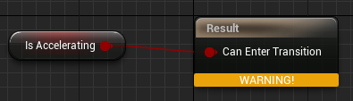</div></pre>

## Definindo as animações para as transições (JogStart para JogStop)

A lógica ficara da seguinte forma utilizando "Get Speed" e "Equal".

<pre><div align='center'><p>BP_ShooterAnimInstance > AnimGraph > Ground Locomotion > JogStart to JogStop (rule)</p>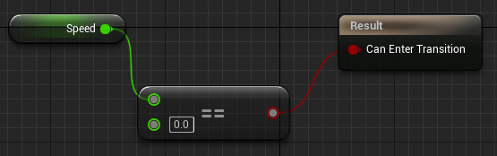</div></pre>

Agora se dermos o play, podemos ver nossas animações funcionando.

## Refinando/Cortando as animações

Agora que colocamos alguma animação no nosso personagem, vimos que ocorrem alguns delays quando paramos ou começamos a andar. Isso ocorrer porque as animações estão completas e não adequadas ao nosso projeto. O que podemos fazer e editar as animações retirando alguns quadros de execução fazendo assim com que elas se encaixem nos nossos estados.

Vamos começar criando um novo diretorio em `Content/_Game/Character` chamado "Animations". Nele vamos colocar as novas animações que formos editando.

Em seguida vamos localizar algumas animações em `ParagonLtBelica/Characters/Heroes/Belica/Animations`. Vamos copiar as animações "Jog_Fwd_Start", "Jog_Fwd_Stop" para nosso novo diretorio de animações. Após vamos renomear as duas animações copiadas para o mesmo nome com final "_trimmed".

<pre><div align='center'><p>Unreal Editor</p>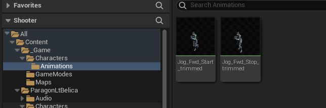</div></pre>

Agora vamos trocar as animações dos nossos estados "JogStart" e "JogStop" por nossas animações "_trimmed".

<pre><div align='center'><p>BP_ShooterAnimInstance > AnimGraph > Ground Locomotion > JogStart (state)</p>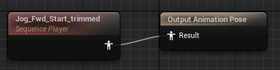</div></pre>

<pre><div align='center'><p>BP_ShooterAnimInstance > AnimGraph > Ground Locomotion > JogSttop (state)</p></div></pre>

Em seguida vamos começar a editar as animações. Começaremos pela "Jog_Fwd_Start_trimmed" clicando nela duas vezes para abrir o editor.

<pre><div align='center'><p>Jog_Fwd_Start_trimmed</p>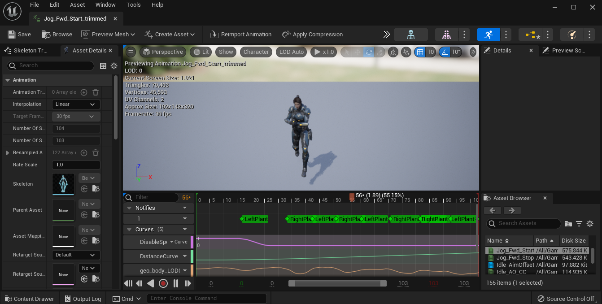</div></pre>

Podemos começar movendo o cursor para a posição do frame no tempo em que queremos fazer o corte. Então posicionando no frame 45, e com o botão direito escolhendo "Remove from frame 47 to frame 104".

<pre><div align='center'><p>Jog_Fwd_Start_trimmed</p>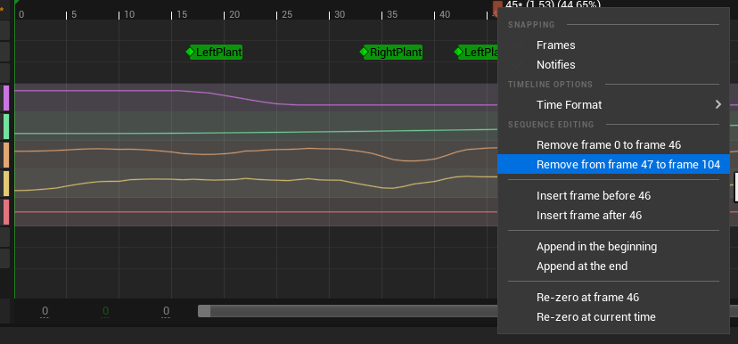</div></pre>

Depois posicionando no frame 15, com o botão direito escolhemos "Remove frame 0 to frame 15".

<pre><div align='center'><p>Jog_Fwd_Start_trimmed</p>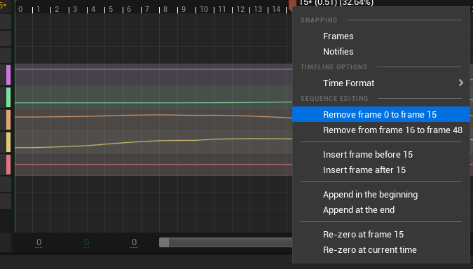</div></pre>

Agora vamos na animação "Jog_Fwd_Stop_trimmed" clicando nela duas vezes para abrir o editor. Posicionando no frame 28, e com o botão direito escolhendo "Remove from frame 0 to frame 28". Depois posicionando no frame 50, com o botão direito escolhemos "Remove frame 51 to frame 87".

## Rotacionando o personagem de acordo com o movimento

Vamos mudar algumas coisas temporiamente fazendo com que a rotação do personagem não acompanhe a rotação da camera.

```c++
// ShooterCharacter.cpp

AShooterCharacter::AShooterCharacter() {
  ...

  // don't rotate when the camera rotates. Let the controller only affect the camera
  bUseControllerRotationPitch = false;
  bUseControllerRotationYaw = false;
  bUseControllerRotationRoll = false;

  // Configure character movement
  GetCharacterMovement()->bOrientRotationToMovement = true; // Character move in the direction of input...
  GetCharacterMovement()->RotationRate = FRotator(0.f, 540.f, 0.f); // ... at this rotation rate
}
```

Para garantir que essas mudanças funcionem, é necessário que no blueprint de nosso personagem, no componente raiz, na seção Pawn, a opção "Use Controller Rotation Yaw" esteja desmarcada.

<pre><div align='center'><p>BP_ShooterCharacter</p>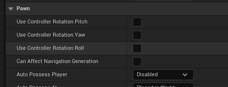</div></pre>

E no componente `CharacterMovement` na seção "Character Movement (Rotation Settings)", a opção Orient Rotation to Movement esteja marcada.

<pre><div align='center'><p>BP_ShooterCharacter</p>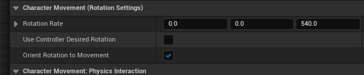</div></pre>

## Controlando o pulo

Podemos adicionar algumas configurações ao nosso component de movimento para controlar o pulo como velocidade de salto e controle no ar.

```c++
// ShooterCharacter.cpp

AShooterCharacter::AShooterCharacter() {
  ...

  // Configure character movement
  GetCharacterMovement()->JumpZVelocity = 600.f;
  GetCharacterMovement()->AirControl = 0.2f;
}
```

## Criando as funções de atirar

Depois de definirmos algumas animações, podemos seguir para outro ponto importante, o de atirar com as armas. Começando por adicionar um mapping para ser nosso botão de tiro. Colocamos o nome de "FireButton" e então adicionamos duas entradas "Left Mouse Button" e "Gamepad Right Trigger".

<pre><div align='center'><p>Unreal Editor > Edit > Project Settings > Input</p>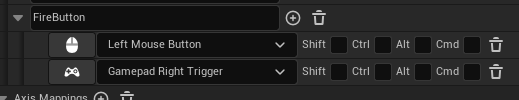</div></pre>

Depois criamos alguns parametros e funções para chamar essas ações, e depois associamos ao nosso controller.

```c++
// ShooterCharacter.h

protected:
  ...

  /** Called when the fire weapon is pressed */
	void FireWeapon();
```

```c++
// ShooterCharacter.cpp

void AShooterCharacter::FireWeapon()
{
  UE_LOG(LogTemp, Warning, TEXT("FIRE WEAPON"));
}

void AShooterCharacter::SetupPlayerInputComponent(UInputComponent* PlayerInputComponent)
{
	...

  PlayerInputComponent->BindAction("FireButton", IE_Pressed, this, &AShooterCharacter::FireWeapon);
}
```

## Definindo os sons de tiro

Vamos criar alguns diretorios. Crie a seguinte estrutura de diretorio: `Content/_Game/Assets/Sounds/GunShots`. Depois faça o download do arquivo "AR15_Shots.zip" que esta neste [Repositorio](https://github.com/DruidMech/UE4-CPP-Shooter-Series/tree/master/Assets/Sounds). Faça a extração dos arquivos, e depois no Unreal no diretorio Gunshots clique com o botão direito e escolha "Add/Import Content > Import tp /Game/_Game/Assets/Sounds/GunShots".

<pre><div align='center'><p>Unreal Editor</p>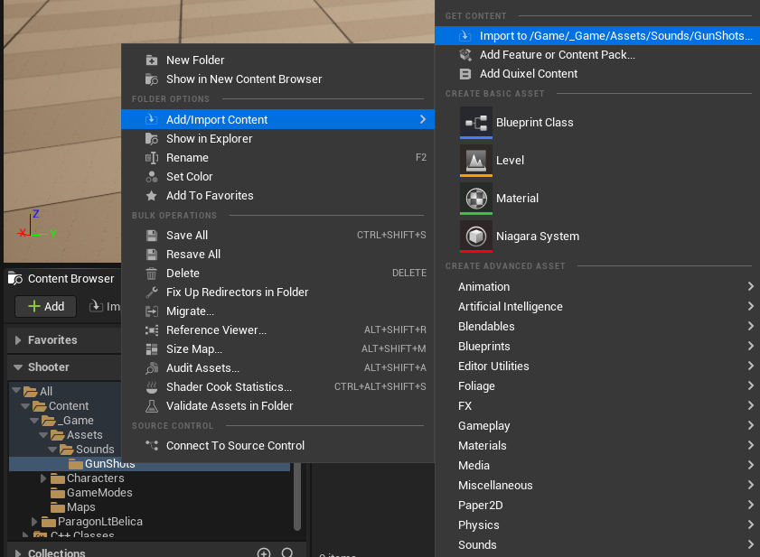</div></pre>

Depois de importados, podemos criar um "Sound Cue", que é o objeto no qual podemos fazer a junção com algumas lógica de varions sons. Para isso clicamos com o botão direito em algum audio e escolhemos "Create Cue".

<pre><div align='center'><p>Unreal Editor</p>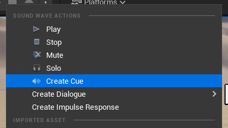</div></pre>

Podemos dar o nome de "AR_Shot". Então clicamos duas vezes nele para abrir o editor cue. Nele podemos ver algo parecido com o editor de blueprint.

<pre><div align='center'><p>AR_Shot</p>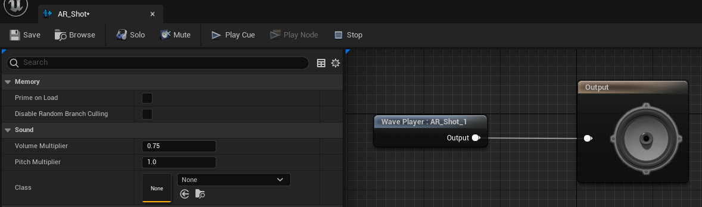</div></pre>

Agora vamos arrastar os outros audios para dentro dessa janela de editor cue, assim tendo todos os audios no editor.

<pre><div align='center'><p>AR_Shot</p>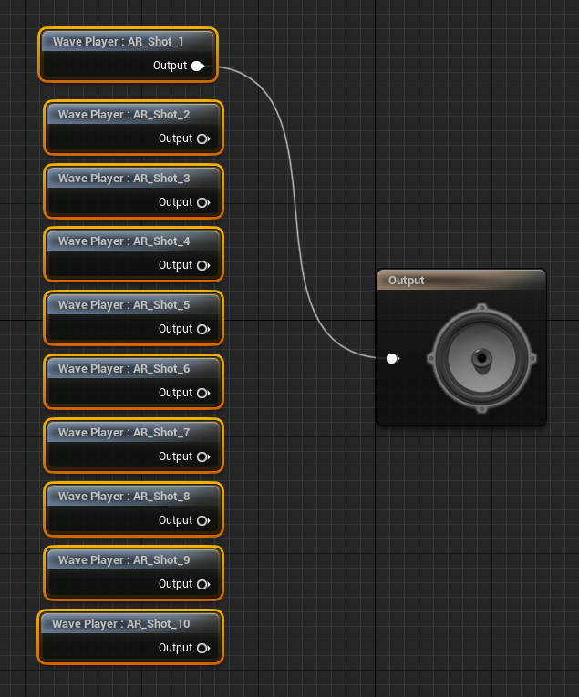</div></pre>

Agora o que vamos fazer é adicionar uma lógica para tocar um som aleatorio toda vez que esse cue for acionado. Para isso arrastamos de algum nó de som, e escolhemos a função "Random".

<pre><div align='center'><p>AR_Shot</p>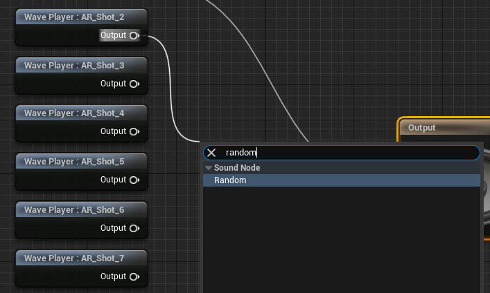</div></pre>

Então nos conectamos todos os sons a esse nó "Random" e depois o ligamos a nossa "Output". Ficando da seguinte forma:

<pre><div align='center'><p>AR_Shot</p>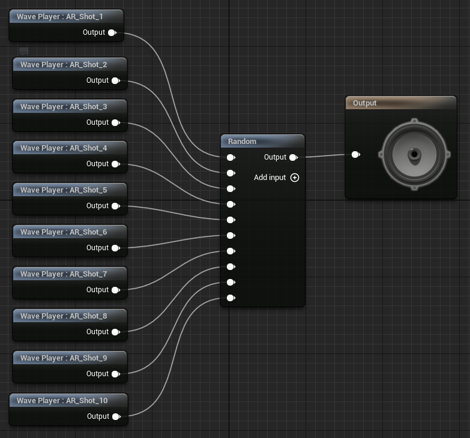</div></pre>

Agora podemos referenciar esse nosso "Sound Cue" no nosso personagem.

```c++
// ShooterCharacter.h

private:
  ...

  /** Randomized gunshot sound cue */
  UPROPERTY(EditAnywhere, BlueprintReadWrite, Category = Combat, meta = (AllowPrivateAccess = "true"))
  class USoundCue* FireSound;


```

```c++
// ShooterCharacter.cpp

#include "Kismet/GameplayStatics.h"
#include "Sound/SoundCue.h"

...

void AShooterCharacter::FireWeapon()
{
    if (FireSound)
    {
        UGameplayStatics::PlaySound2D(this, FireSound);
    }
}
```

E finalmente, vamos no blueprint de nosso personagem, e na seção "Combat" definimos a opção "Fire Sound" com nosso "Sound Cue" "AR_Shot" criado.

<pre><div align='center'><p>BP_ShooterCharacter</p>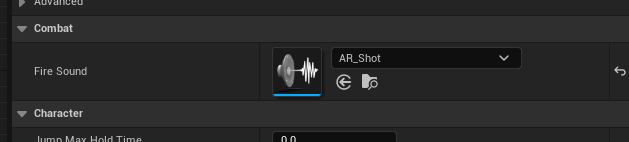</div></pre>

## Adicionando efeitos de particula

Depois de definirmos os sons quando atiramos, agora é hora de adicionar alguns efeitos de particula. Para pordemos fazer isso, precisamos de um local no mesh onde possamos usar como ponto de geração das particulas. Isso pode ser feito através do uso de "Sockets". Vamos no blueprint de nosso character, clicando no componente de "Mesh" e em seguida na seção "Mesh", clicamos no icone de "Browser Asset".

<pre><div align='center'><p>BP_ShooterCharacter</p>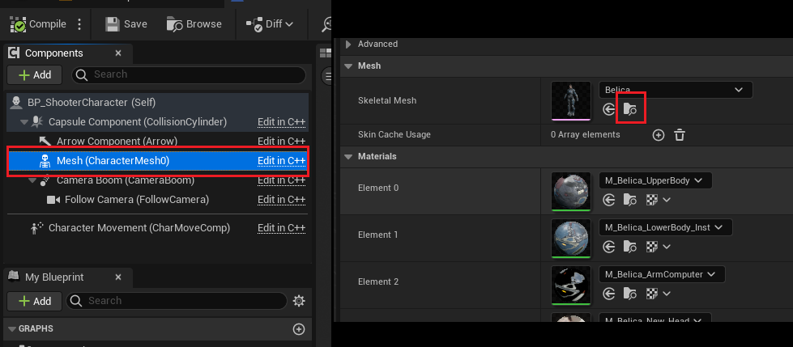</div></pre>

De lá, seremos direcioandos para a janela principal do Unreal, diretamente para os assets onde está nosso mesh.

<pre><div align='center'><p>Unreal Editor</p>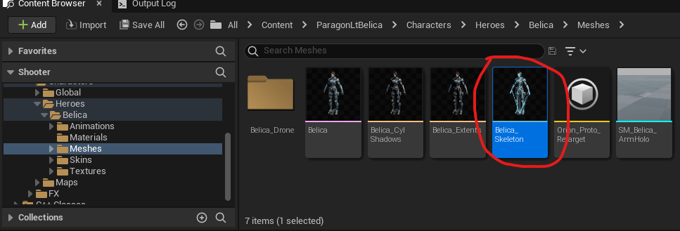</div></pre>

Então selecionamos e abrimos o esqueleto "Belica_Skeleton", indo assim para o editor de esqueleto.

<pre><div align='center'><p>Belica_Skeleton</p>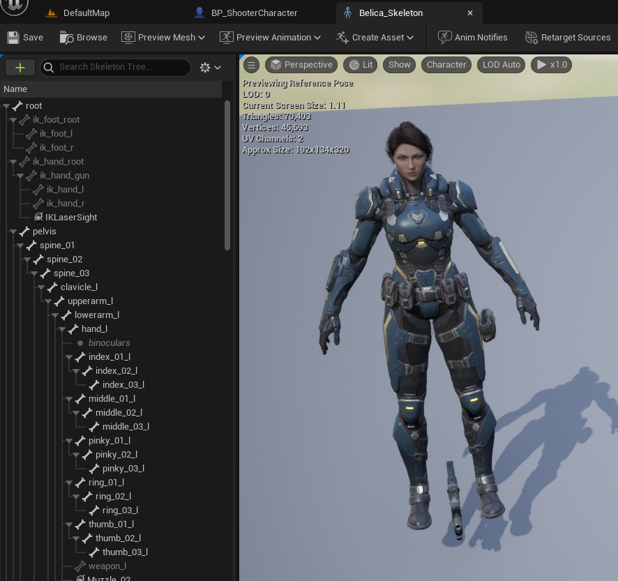</div></pre>

Nós iremos agora adicionar um "Socket" ao osso ("Bone") associado a arma do personagem. Podemos encontra-lo procurando por "weapon".

<pre><div align='center'><p>Belica_Skeleton</p>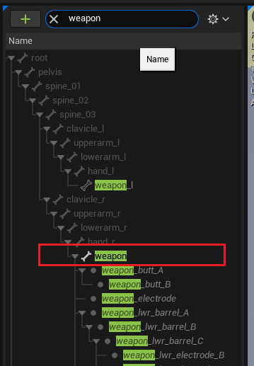</div></pre>

Nós o selecionamos então, e ao fazer isso, podemos ver claramente o "Bone" ligado a arma.

<pre><div align='center'><p>Belica_Skeleton</p>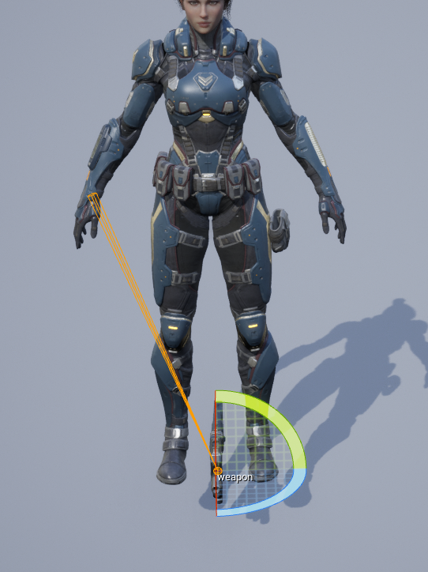</div></pre>

Em seguida clicamos com o botão direito no "Bone" e vamos em "Add Socket"

<pre><div align='center'><p>Belica_Skeleton</p>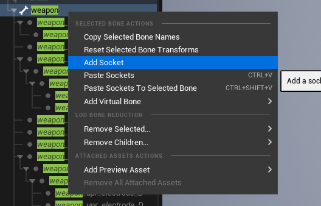</div></pre>

Depois o renomeamos para "BarrelSocket".

<pre><div align='center'><p>Belica_Skeleton</p>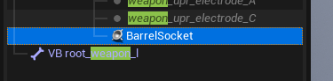</div></pre>

Agora no editor vamos rotacionar um pouco para vermos melhor o "Socket".

<pre><div align='center'><p>Belica_Skeleton</p>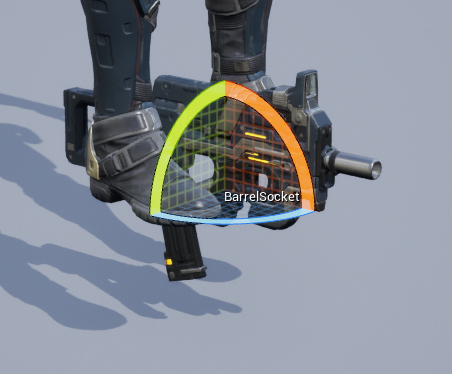</div></pre>

E então vamos mover ele para a ponta da arma, deixando-o bem alinhado.

<pre><div align='center'><p>Belica_Skeleton</p>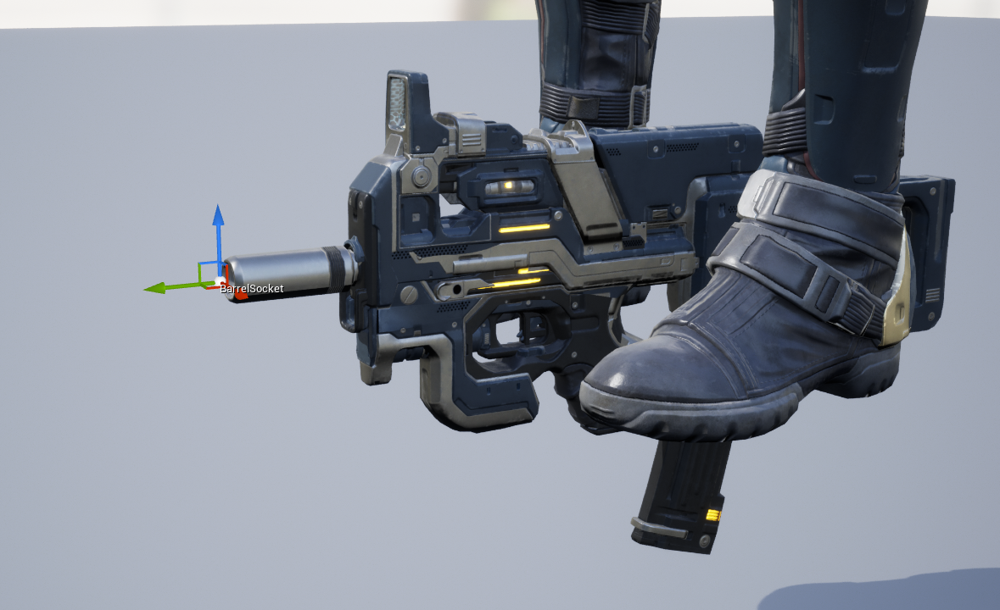</div></pre>

E por fim rotacionamos ele para que o eixo X do pivot esteja voltado para frente da arma.

<pre><div align='center'><p>Belica_Skeleton</p>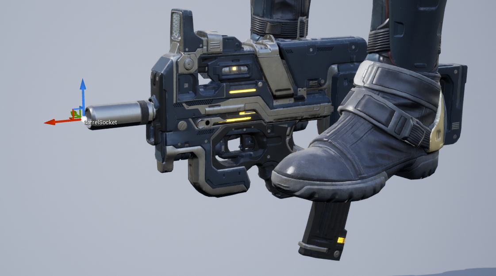</div></pre>

Agora vamos implementar algumas coisas em nosso código.

```c++
// ShooterCharacter.h

private:
  /** Flash spawned at BarrelSocket */
  UPROPERTY(EditAnywhere, BlueprintReadWrite, Category = Combat, meta = (AllowPrivateAccess = "true"))
  class UParticleSystem* MuzzleFlash;
```

```c++
// ShooterCharacter.cpp

void AShooterCharacter::FireWeapon()
{
  if (FireSound)
  {
    UGameplayStatics::PlaySound2D(this, FireSound);
  }

  const USkeletalMeshSocket* BarrelSocket = GetMesh()->GetSocketByName("BarrelSocket");

  if (BarrelSocket)
  {
    const FTransform SocketTransform = BarrelSocket->GetSocketTransform((GetMesh()));

    if (MuzzleFlash)
    {
      UGameplayStatics::SpawnEmitterAtLocation(GetWorld(), MuzzleFlash, SocketTransform);
    }
  }
}
```

Depois precisamos do nosso sistema de particulas. Primeiramente precisamos criar um diretorio para fazermos uma copia do arquivo de particulas. Vamos criar um diretorio em `Content/_Games/Assets` chamado "FX". Então copiamos o arquivo "P_BelicaMuzzle" que está em `Content/ParagonLtBelica/FX/Particles/Belica/Abilities/Primary/FX` para nosso novo diretorio. Renomeamos ele para P_BelicaMuzzle_single_burst.Então o selecionamos e abrimos ele.

<pre><div align='center'><p>P_BelicaMuzzle_single_burst</p>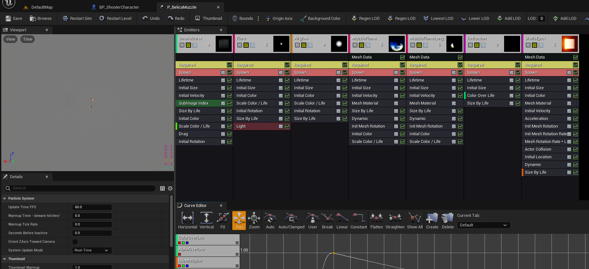</div></pre>

Esse sistema de particulas tem uma animação de três balas caindo. Precisamos fazer que seja apenas uma. Cada uma das seções na direita são diferentes componentes do sistema de particula.

<pre><div align='center'><p>P_BelicaMuzzle_single_burst</p>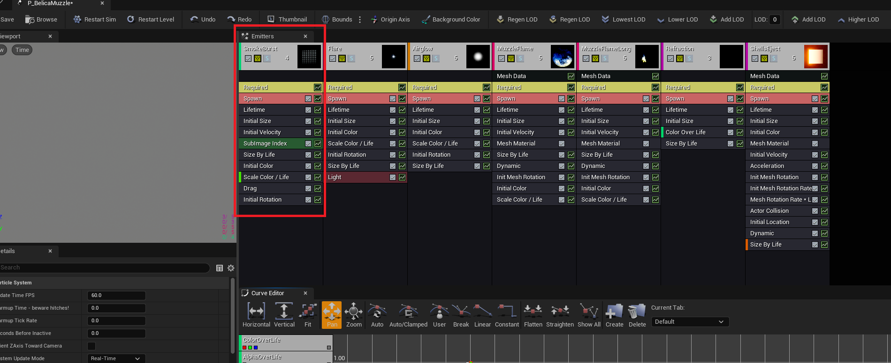</div></pre>

Se clicarmos no componente "SmokeBurst", e na opção "Spawn", e formos na seção dele na esquerda chamada "Burst", poderemos ver que existe a opção "Burst List", e ao expandirmos ela, veremos que existe um elemento com os membros "Count", "Count Low" e "Time".

<pre><div align='center'><p>P_BelicaMuzzle_single_burst</p>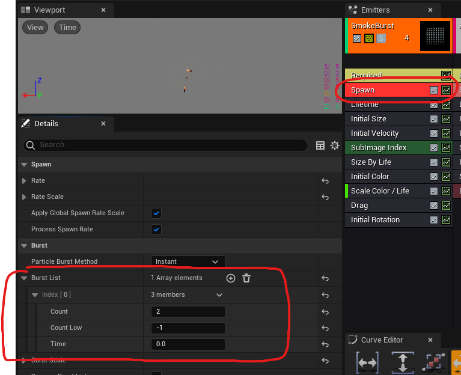</div></pre>

Podemos constatar que existe apenas um efeito de bala associado. Se fizermos o mesmo processo para o componente "Flare", veremos que existem três elementos.

<pre><div align='center'><p>P_BelicaMuzzle_single_burst</p>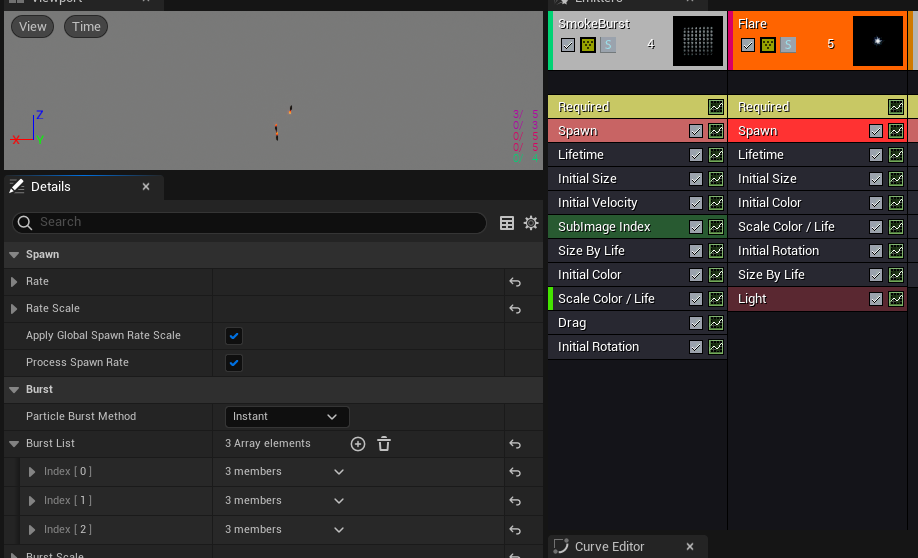</div></pre>

Podemos então excluir os últimos dois e deixar apenas o primeiro, ficando assim somente o efeito de uma bala caindo.

<pre><div align='center'><p>P_BelicaMuzzle_single_burst</p>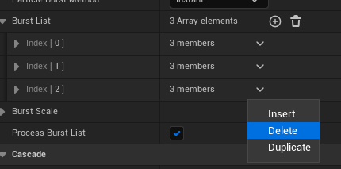</div></pre>

Temos que repetir o processo pra todo componente que tiver 3 elementos naquela seção. Após remover os demais elementos de cada componente, podemos salvar.

Agora vamos no blueprint de nosso personagem na seção "Combat", e definimos como "Muzzle Flash" esse nosso sistema de particulas que acabamos de editar, o "P_BelicaMuzzle_single_burst".

<pre><div align='center'><p>BP_ShooterCharacter</p>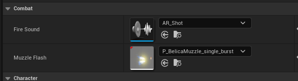</div></pre>

Agora é só compilar, salvar e testar.

## Adicionando uma animação de tiro e recuo de tiro

Depois de implementar nosso sistema de particulas ao tiro, vamos precisar agora adicionar uma animação de recuo quando nosso personagem atira. Para isso precisaremos criar uma "Animation Montage".

Então no diretorio `Content/_Game/Character/Animations` vamos criar um "Animation Montage".

<pre><div align='center'><p>Unreal Editor</p>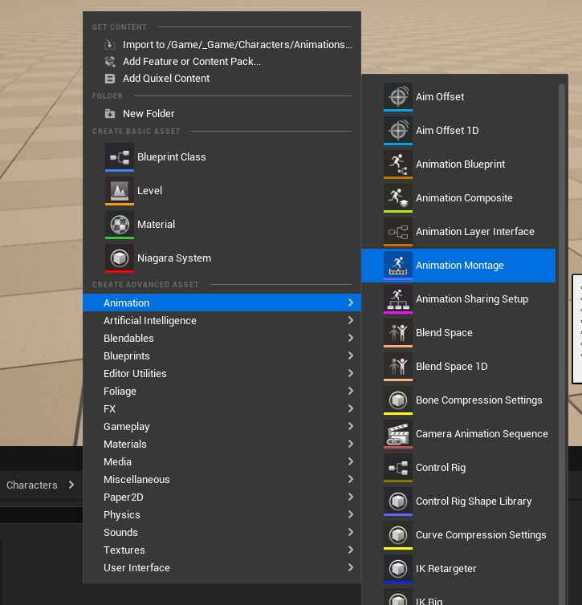</div></pre>

Selecionando como esqueleto o "Belica_Skeleton".

<pre><div align='center'><p>Unreal Editor</p>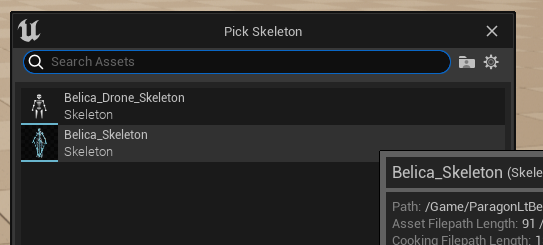</div></pre>

Vamos chama-lo de "HipFireMontage".

Agora precisamos de uma animação que atire com a arma de fogo. Escolheremos a "Primary_Fire_Fast" que está em `ParagonLtBelica/Characters/Heroes/Belica/Animations`, e a copiaremos para nosso diretorio de animações. Vamos também renomear para "Primary_Fire_Fast_trimmed". E em seguida abrir a animação.

Agora vamos remover do frame 9 até o 19 escolhendo a opção "Remove from frame 9 to frame 19".

Em seguida vamos adicionar essa animação a nossa "Animation Montage", abrindo ela e escolhendo nossa animação na aba "Asset Browser" na direita inferior, e então arrastando ela pro editor.

<pre><div align='center'><p>HipFireMontage</p>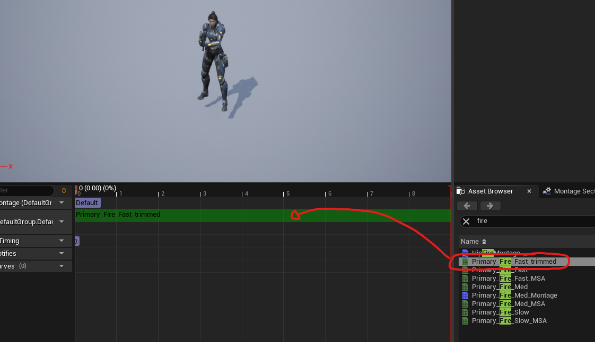</div></pre>

Por padrão nós já temos uma seção no editor chamada "Default".

<pre><div align='center'><p>HipFireMontage</p>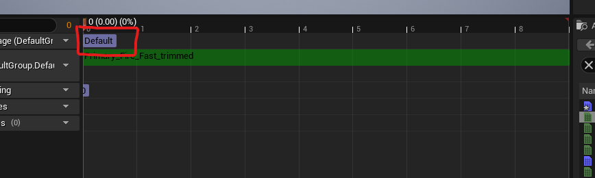</div></pre>

Para deletar a seção "Default" temos que criar uma nova seção e colocar a frente da "Default". Podemos chamar ela de "StartFire".

<pre><div align='center'><p>HipFireMontage</p>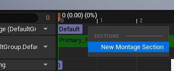</div></pre>

<pre><div align='center'><p>HipFireMontage</p>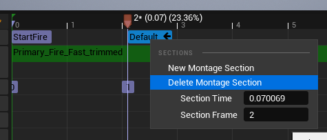</div></pre>

Restando somente a seção "StartFire":

<pre><div align='center'><p>HipFireMontage</p>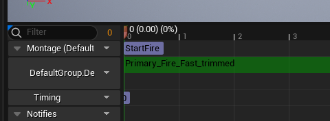</div></pre>

Agora vamos precisar de um "Slot" para nosssa seção. Esse "Slot" permitira que nós possamos criar e direcionar animações para nossa pose de saída no blueprint de animação.

Vamos fazer isso indo na direita inferior, na aba "Anim Slot Manager". Se essa aba não estiver ativa, precisaremos ativar ela selecionando a mesma em `Window > Anim Slot Manager`.

Então podemos criar um novo slot chamado "Weapon Fire".

<pre><div align='center'><p>HipFireMontage</p>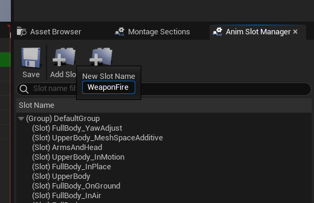</div></pre>

Depois associamos nossa "Montage" a este slot, escolhendo em `DefaultGroup.DefaultSlot > Slot name > DefaultGroup.WeaponFire`.

<pre><div align='center'><p>HipFireMontage</p>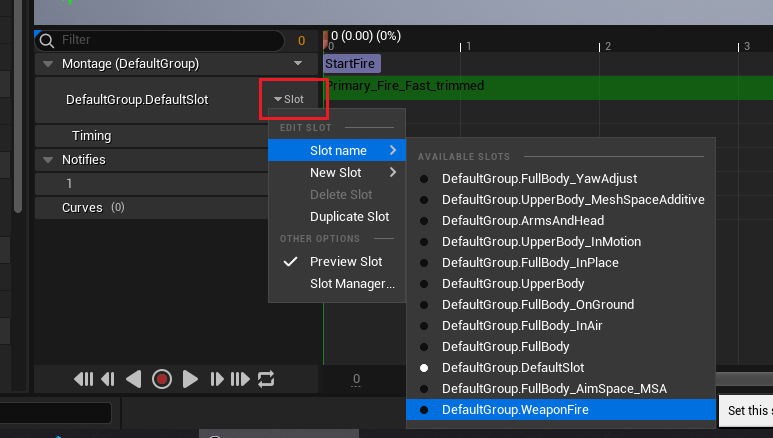</div></pre>

Ficando desta forma:

<pre><div align='center'><p>HipFireMontage</p>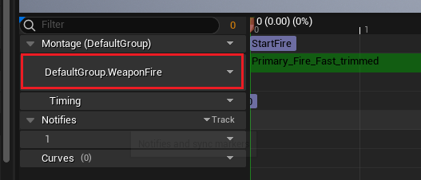</div></pre>

Agora precisamos garantir que o blueprint de nossa animação esteja usando essse "Slot", indo no blueprint "BP_ShooterAnim". Da janela que estamos podemos apenas clicar na parte superior para avançar para o blueprint de animação associado ao personagem:

<pre><div align='center'><p>HipFireMontage</p>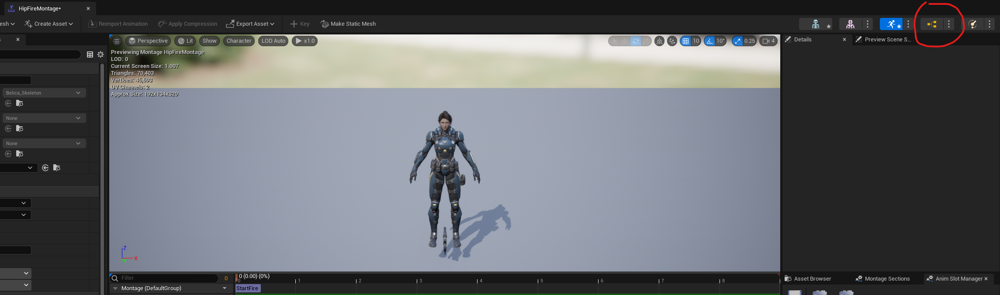</div></pre>

No blueprint da animação vamos ter que fazer um cache dos estados que criamos anteriormente em "Ground Locomotion".

<pre><div align='center'><p>BP_ShooterAnim > AnimGraph</p>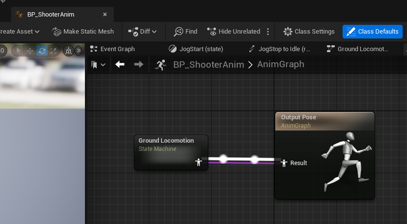</div></pre>

Para fazer isso, podemos puchar o nó de "Ground Locomotion" e procuar por "New Save cached pose". O recurso Pose Caching no Control Rig é usado para salvar e aplicar poses de animação em momentos diferentes no gráfico do equipamento de controle. Qualquer elemento de plataforma pode ser armazenado em cache em uma pose e diferentes propriedades podem ser acessadas no gráfico de plataforma, como valores de curva ou transformações.

<pre><div align='center'><p>BP_ShooterAnim > AnimGraph</p>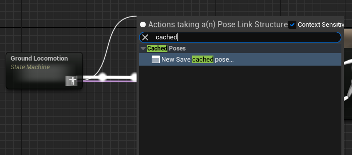</div></pre>

Vamos renomear para "Cached Ground Locomotion". Resumindo, esse "cached pose" serve pra armazenar dados de um "State Machine" para ser usado posteriormente.

Para podermos usar um "State Machine" em "Cache", podemos buscar por "Use cached pose 'Nome da State Machine'", que é o que faremos agora, buscando por "Use cached pose 'Cached Ground Locomotion'", e adicionando.

<pre><div align='center'><p>BP_ShooterAnim > AnimGraph</p>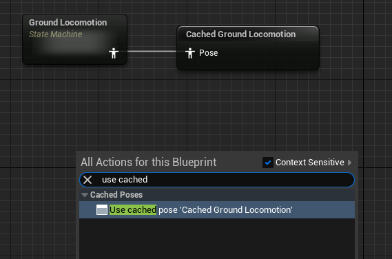</div></pre>

E plugando novamente na nossa pose de saída, teremos basicamente o mesmo efeito de antes.

<pre><div align='center'><p>BP_ShooterAnim > AnimGraph</p>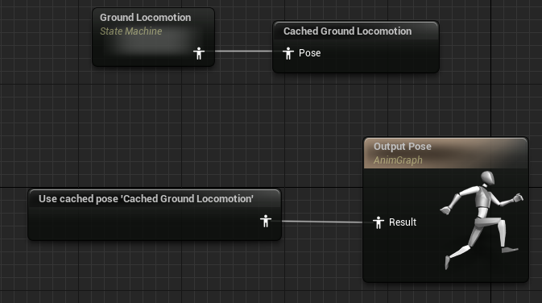</div></pre>

Vamos desplugar "Use cached pose 'Cached Ground Locomotion'" da nossa pose de saída, e puxar da mesma criando um "Slot".

<pre><div align='center'><p>BP_ShooterAnim > AnimGraph</p>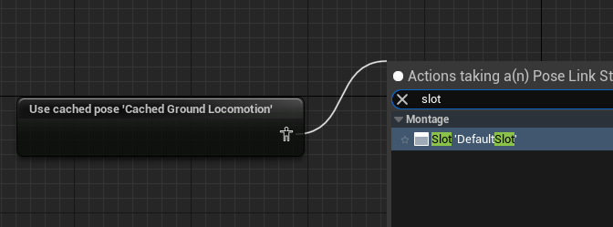</div></pre>

Selecionando o "Slot", no menu da direita na seção "Settings", temos que escolher o "Slot" criado anteriormente "WeaponFire" em "Slot Name".

<pre><div align='center'><p>BP_ShooterAnim > AnimGraph</p>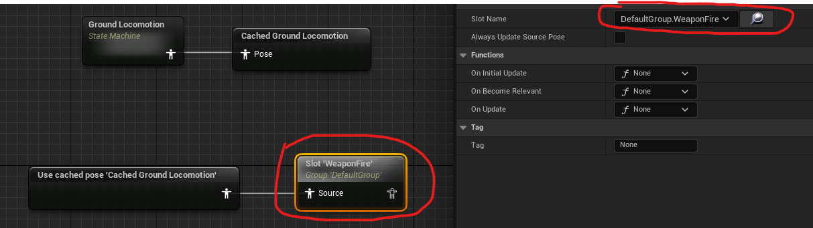</div></pre>

Agora ligamos esse nó com nosso "Slot" à pose de saída.

<pre><div align='center'><p>BP_ShooterAnim > AnimGraph</p>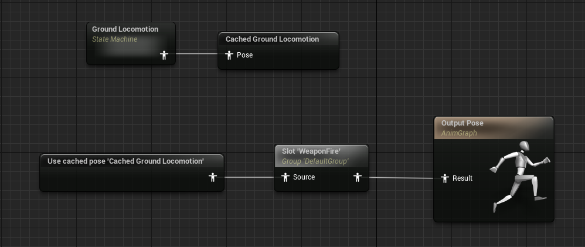</div></pre>

Agora vamos adicionar uma referencia de nossa "Animation Montage" ao nosso personagem com o seguinte codigo:

```c++
// ShooterCharacter.h

private:

  /** Montage for firing the weapon */
  UPROPERTY(EditAnywhere, BlueprintReadWrite, Category = Combat, meta = (AllowPrivateAccess = "true"))
  class UAnimMontage* HipFireMontage;

```

```c++
// ShooterCharacter.cpp

void AShooterCharacter::FireWeapon()
{
  if (FireSound)
  {
    UGameplayStatics::PlaySound2D(this, FireSound);
  }

  const USkeletalMeshSocket* BarrelSocket = GetMesh()->GetSocketByName("BarrelSocket");

  if (BarrelSocket)
  {
    const FTransform SocketTransform = BarrelSocket->GetSocketTransform((GetMesh()));

    if (MuzzleFlash)
    {
      UGameplayStatics::SpawnEmitterAtLocation(GetWorld(), MuzzleFlash, SocketTransform);
    }
  }

  UAnimInstance* AnimInstance = GetMesh()->GetAnimInstance();

  if (AnimInstance && HipFireMontage)
  {
    AnimInstance->Montage_Play(HipFireMontage);
    AnimInstance->Montage_JumpToSection(FName("StartFire"));
  }
}
```

E finalmente definimos no blueprint do nosso personagem "BP_ShooterCharacter" nossa "Animation Montage", indo na seção "Combat" e escolhendo "HipFireMontage".

<pre><div align='center'><p>BP_ShooterCharacter</p>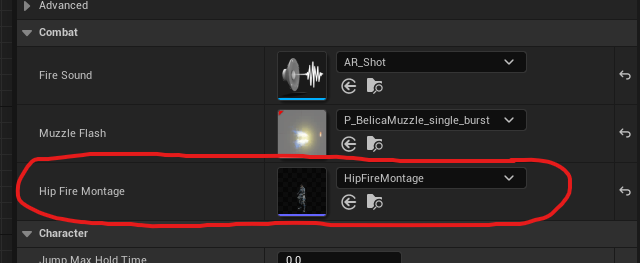</div></pre>

Então compile e salve.

Voltemos ao nosso "Animation Montage" "HipFireMontage", e na aba "Asset Details", na seção "Blend Option" vamos colocar a opção "Blend Time" em 0.0.

<pre><div align='center'><p>HipFireMontage</p>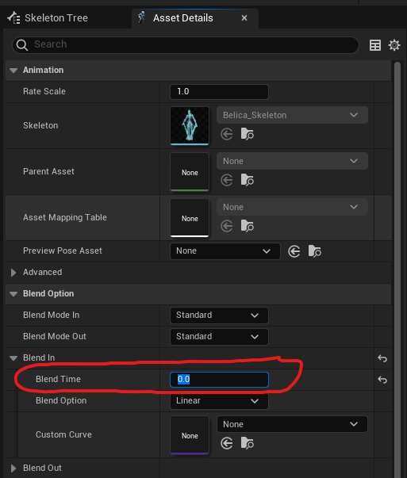</div></pre>

Então podemos salvar e testar.

<pre><div align='center'>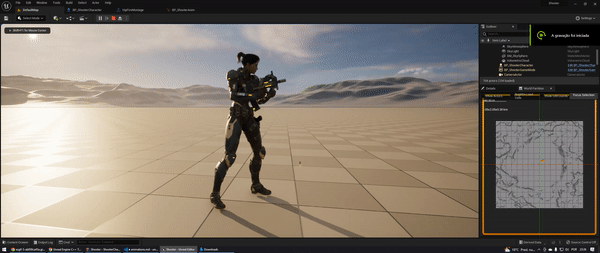</div></pre>

## Combinando a animação de tiro com a animação de movimento

Temos que fazer isso pois atualmente se nos movermos e atirarmos, veremos que nosso personagem executa a animação de atirar interropendo a animação de movimento. Precisamos agora fazer com que apenas uma parte do corpo faça a animação de atirar, enquanto a outra fica livre pra fazer a animação de tiro, deixando tudo bem natural.

Vamos começar abrindo nosso blueprint da animação do personagem "BP_ShooterAnim".

Atualmente nós colocamos em cache todo nosso movimento básico e então repassamos para nosso slot de "FireWeapon" no qual o sobrepõe quando é executado. Então o que iremos fazer agora é misturar os dois.

Primeiro vamos separar em uma seção os seguintes nós, pressionando a tecla C depois de seleciona-los, e colocando o nome de "Cached Ground Locomotion".

<pre><div align='center'><p>BP_ShooterAnim > AnimGraph</p>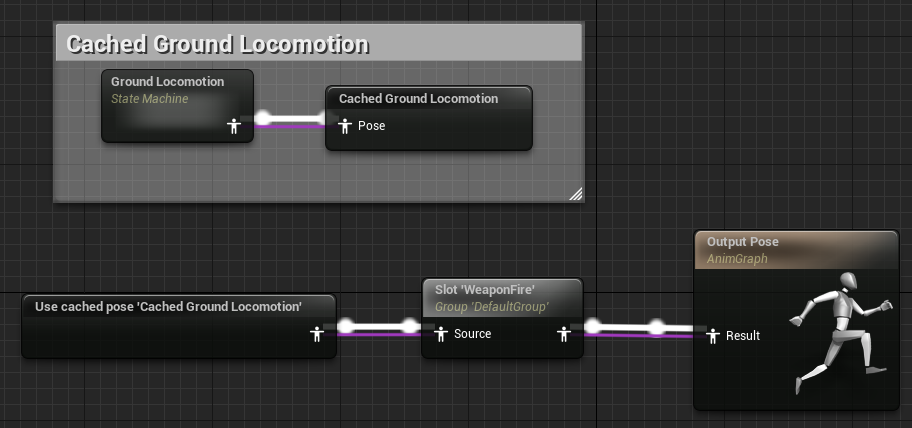</div></pre>

Em seguida vamos deixar em cache também o cache de "Ground Locomotion" e do "Slot", renomeando esse cache para "Cached Weapon Fire", seguido pela separação destes em uma seção chamada "Cached Ground Locomotion with Weapon Fire Slot"

<pre><div align='center'><p>BP_ShooterAnim > AnimGraph</p>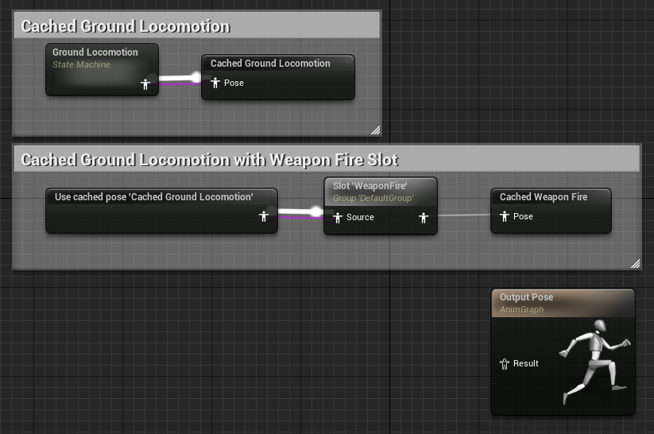</div></pre>

Agora para fazermos a mistura entre ambos, vamos precisar do nó "Layered blend per bone".

<pre><div align='center'><p>BP_ShooterAnim > AnimGraph</p>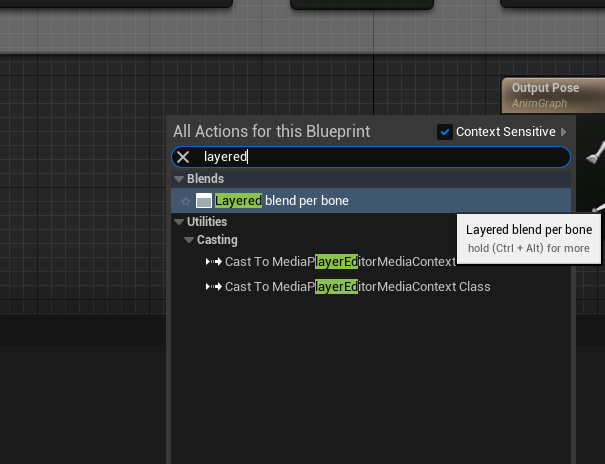</div></pre>

<pre><div align='center'><p>BP_ShooterAnim > AnimGraph</p>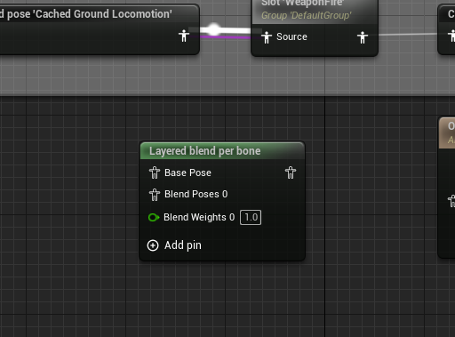</div></pre>

Um detalhe é que a combinação entre as duas poses se dará a partir de um "Bone" do esqueleto do nosso personagem. O que queremos em qeustão é que a animação de tiro seja somente da metade do corpo pra cima, logo podemos escolher o "Bone" "spine_01". Vamos fazer isso clicando no nó "Layered blend per bone" e na direita, na seção "Config", expandimos a opção "Layer setup", depois expandimos dentro a opção Index[0], que é um array, é criamos um novo elemento, para depois, expandimos esse elemento também chegando no seguite resultado.

<pre><div align='center'><p>BP_ShooterAnim > AnimGraph</p>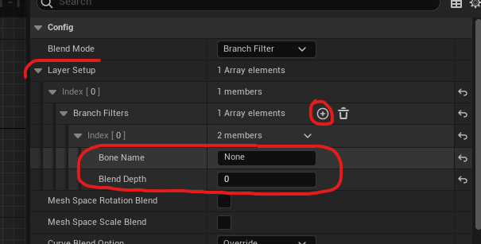</div></pre>

Teremos então duas propriedades para alterar: "Bone Name" e "Blend Depth". Em "Bone Name" escolhemos o bone "spine_01".

<pre><div align='center'><p>BP_ShooterAnim > AnimGraph</p>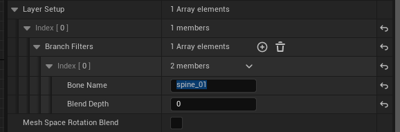</div></pre>

Em seguida podemos ligar a este nó, nossas poses em cache. Primeiro "Use cached pose 'Cached Ground Locomotion'" ligado ao nó em "Base Pose", e depois "Use cached pose 'Cached Weapon Fire'" ligado ao nó em "Blend Poses 0". Vamos colocar todos estes em uma seção chamada "Blend Between Ground Locomotion and Weapon Fire", finalizamos ligando esse nó a nossa pose de saída.

<pre><div align='center'><p>BP_ShooterAnim > AnimGraph</p>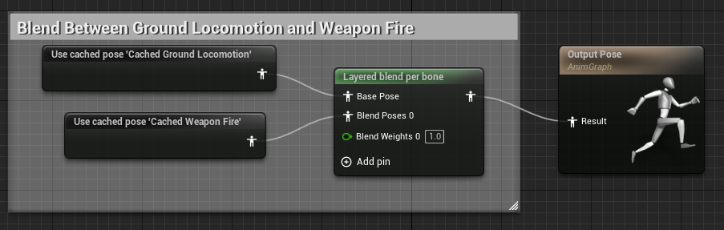</div></pre>

Agora podemos compilar, salvar e testar.

<pre><div align='center'></div></pre>

## Realizando Line Trace

Agora vamos continuar implementando nossa mecanica de tiro acrescentando Line Trace para o impacto tiros quando atirarmos.

```diff
// ChooterCharacter.cpp

void AShooterCharacter::FireWeapon()
{
    if (FireSound)
    {
        UGameplayStatics::PlaySound2D(this, FireSound);
    }

    const USkeletalMeshSocket* BarrelSocket = GetMesh()->GetSocketByName("BarrelSocket");

    if (BarrelSocket)
    {
        const FTransform SocketTransform = BarrelSocket->GetSocketTransform((GetMesh()));

        if (MuzzleFlash)
        {
            UGameplayStatics::SpawnEmitterAtLocation(GetWorld(), MuzzleFlash, SocketTransform);
        }

+        FHitResult FireHit;
+        const FVector Start { SocketTransform.GetLocation() };
+        const FQuat Rotation { SocketTransform.GetRotation() };
+        const FVector RotationAxis { Rotation.GetAxisX() };
+        const FVector End { Start + RotationAxis * 50'000.f };

+        GetWorld()->LineTraceSingleByChannel(FireHit, Start, End, ECollisionChannel::ECC_Visibility);

+        if (FireHit.bBlockingHit)
+        {
+            DrawDebugLine(GetWorld(), Start, End, FColor::Red, false, 2.f);
+            DrawDebugPoint(GetWorld(), FireHit.Location, 5.f, FColor::Red, false, 2.f);
+        }
    }

    UAnimInstance* AnimInstance = GetMesh()->GetAnimInstance();

    if (AnimInstance && HipFireMontage)
    {
        AnimInstance->Montage_Play(HipFireMontage);
        AnimInstance->Montage_JumpToSection(FName("StartFire"));
    }
}
```

Depois no editor Unreal, vamos adicionar uma parede, para testar nossa colisão.

<pre><div align='center'><p>Unreal Editor</p>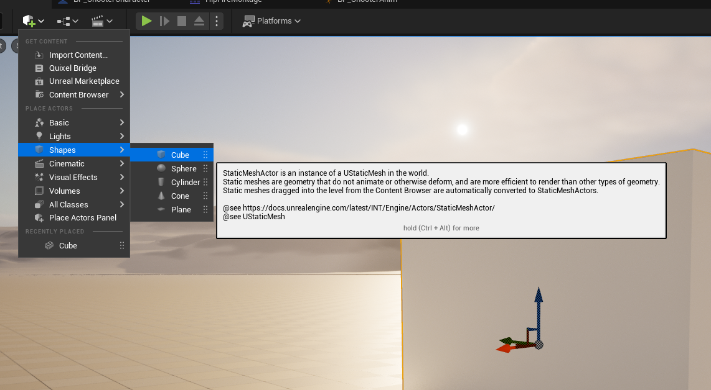</div></pre>

Agora podemos compilar, salvar e testar.

<pre><div align='center'></div></pre>

## Criando particulas de impacto

Agora vamos criar alguns efeitos de impacto quando o tiro colidir. Vamos começar adicionando algum codigo.

```c++
// ShooterCharacter.h

private:
  /** Particles spawned upon bullet impact */
  UPROPERTY(EditAnywhere, BlueprintReadWrite, Category = Combat, meta = (AllowPrivateAccess = "true"))
  class UParticleSystem* ImpactParticles;
```

```diff
// ShooterCharacter.cpp

void AShooterCharacter::FireWeapon()
{
  if (FireSound)
  {
    UGameplayStatics::PlaySound2D(this, FireSound);
  }

  const USkeletalMeshSocket* BarrelSocket = GetMesh()->GetSocketByName("BarrelSocket");

  if (BarrelSocket)
  {
    const FTransform SocketTransform = BarrelSocket->GetSocketTransform((GetMesh()));

    if (MuzzleFlash)
    {
      UGameplayStatics::SpawnEmitterAtLocation(GetWorld(), MuzzleFlash, SocketTransform);
    }

    FHitResult FireHit;
    const FVector Start { SocketTransform.GetLocation() };
    const FQuat Rotation { SocketTransform.GetRotation() };
    const FVector RotationAxis { Rotation.GetAxisX() };
    const FVector End { Start + RotationAxis * 50'000.f };

    GetWorld()->LineTraceSingleByChannel(FireHit, Start, End, ECollisionChannel::ECC_Visibility);

    if (FireHit.bBlockingHit)
    {
      DrawDebugLine(GetWorld(), Start, End, FColor::Red, false, 2.f);
      DrawDebugPoint(GetWorld(), FireHit.Location, 5.f, FColor::Red, false, 2.f);

+      if (ImpactParticles)
+      {
+        UGameplayStatics::SpawnEmitterAtLocation(GetWorld(), ImpactParticles, FireHit.Location);
+      }
    }
  }

  UAnimInstance* AnimInstance = GetMesh()->GetAnimInstance();

  if (AnimInstance && HipFireMontage)
  {
    AnimInstance->Montage_Play(HipFireMontage);
    AnimInstance->Montage_JumpToSection(FName("StartFire"));
  }
}
```
