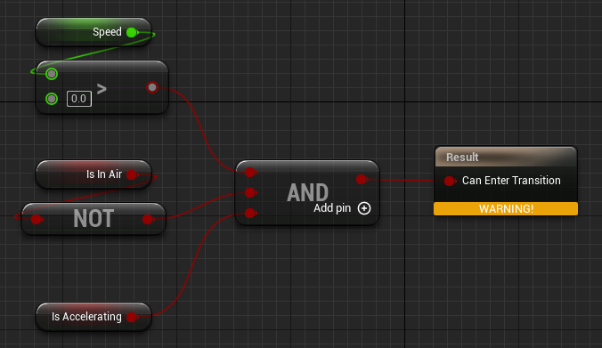
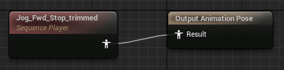

# Animations

## A classe base AnimInstance

Depois de adicionar o modelo ao nosso blueprint, ele se mantem estatico. Isso porque ainda não temos uma animação definida. Para fazer isso primeiro temos que criar uma classe C++. Vamos em adicionar uma nova classe C++, e depois vamos na aba "All Classes", procuramos por "AnimInstance", e então selecionamos ela como classe base. Vamos nomear a classe de `ShooterAnimInstance`. E depois vamos definir algumas variaveis e funções para nossa nova classe.

```c++
// ShooterAnimInstance.h
...
public:
	UFUNCTION(BlueprintCallable)
	void UpdateAnimationProperties(float DeltaTime);

	virtual void NativeInitializeAnimation() override;

private:
	UPROPERTY(VisibleAnywhere, BlueprintReadOnly, Category = Movement, meta = (AllowPrivateAccess = "true"))
	class AShooterCharacter* ShooterCharacter;

  /** The speed of the character */
  UPROPERTY(VisibleAnywhere, BlueprintReadOnly, Category = Movement, meta = (AllowPrivateAccess = "true"))
  float Speed;

  /** Whether or not the character is in the air */
  UPROPERTY(VisibleAnywhere, BlueprintReadOnly, Category = Movement, meta = (AllowPrivateAccess = "true"))
  bool bIsInAir;

  /** Whether or not the character is moving */
  UPROPERTY(VisibleAnywhere, BlueprintReadOnly, Category = Movement, meta = (AllowPrivateAccess = "true"))
  bool bIsAccelerating;
```

```c++
// ShooterAnimInstance.cpp

#include "ShooterCharacter.h"
#include "GameFramework/CharacterMovementComponent.h"

void UShooterAnimInstance::UpdateAnimationProperties(float DeltaTime)
{
	if (ShooterCharacter)
	{
		ShooterCharacter = Cast<AShooterCharacter>(TryGetPawnOwner());
	}
  if (ShooterCharacter)
  {
    // get the lateral speed of the character from velocity
    FVector Velocity { ShooterCharacter->GetVelocity() };
    Velocity.Z = 0;
    Speed = Velocity.Size();

    // Is the character in the air?
    bIsInAir = ShooterCharacter->GetCharacterMovement()->IsFalling();

    // the character accelerating?
    if (ShooterCharacter->GetCharacterMovement()->GetCurrentAcceleration().Size() > 0.f)
    {
      bIsAccelerating = true;
    }
    else
    {
      bIsAccelerating = false;
    }
  }
}

void UShooterAnimInstance::NativeInitializeAnimation()
{
	Super::NativeInitializeAnimation();

	ShooterCharacter = Cast<AShooterCharacter>(TryGetPawnOwner());
}
```

## Criando o blueprint da animação baseado em nossa class

Agora depois de criarmos nossa classe pra animação, vamos criar um blueprint baseado na mesma. Para isso vamos no diretorio `Content/_Game/Character` e com o botão direito, vamos em "Animation" e depois em "Animation Blueprint".

<pre><div align='center'><p>Unreal Editor</p></div></pre>

Então selecionamos como classe base nossa classe `ShooterAnimInstance` e selecionamos tambpem o esqueleto do modelo sendo o "Belica_Skeleton", e então clicamos em "Create".

<pre><div align='center'><p>Unreal Editor</p></div></pre>

Podemos colocar o nome no blueprint de "BP_ShooterAnim".

Após, podemos associar esse blueprint de animação ao blueprint do nosso personagem indo em no blueprint do personagem, e a direita na seção "Animation" selecionamos "Animation Mode" como "Use Animation Blueprint", e em "Anim Class" escolhemos o blueprint de animação que acabamos de criar.

<pre><div align='center'><p>BP_ShooterAnimInstance</p></div></pre>

Depois disso compile o blueprint.

## Definindo as os estados de animações

Agora podemos abrir o blueprint da animação "BP_ShooterAnim". No editor de blueprint nós teremos o "Event Graph" onde poderemos colocar a lógica do blueprint e o "AnimGraph" que será responsavel pela lógica da animação e mudança de estados.

<pre><div align='center'><p>BP_ShooterAnimInstance > AnimGraph</p></div></pre>

Começaremos chamando a função que criamos `UpdateAnimationProperties` no "Event Graph", ligando o "Event Blueprint Update Animation" a nossa função.

<pre><div align='center'><p>BP_ShooterAnimInstance > Event Graph</p></div></pre>

Agora podemos criar alguns "State Machines". Para isso no "AnimGraph" criaremos um estado através do "Add New State Machine".

<pre><div align='center'><p>BP_ShooterAnimInstance > AnimGraph</p></div></pre>

Depois de criar, vamos renomear para "Ground Locomotion" e ligá-lo ao nossa pose de saída ("Output Pose").

<pre><div align='center'><p>BP_ShooterAnimInstance > AnimGraph</p></div></pre>

Agora a cada frame, cada retorno de Ground Locomotion irá alimentar a pose de saída fazendo assim a animação.

Vamos editar no estado clicando nele duas vezes.

<pre><div align='center'><p>BP_ShooterAnimInstance > AnimGraph > Ground Locomotion</p></div></pre>

Vamos adicionar alguns estados a esse "Machine". Clicando na seta branca e arrastando para o lado, e depois escolhendo "Add State".

<pre><div align='center'><p>BP_ShooterAnimInstance > AnimGraph > Ground Locomotion</p></div></pre>

Chamaremos esse de "Idle".

<pre><div align='center'><p>BP_ShooterAnimInstance > AnimGraph > Ground Locomotion</p></div></pre>

A partir daí criaremos outros estados.

- Idle: é a animação base de nosso personagem parado. A partir dela nosso personagem pode começar a se movimentar indo pro estado "JogStart";
- JogStart: é a animação que nosso personagem sai do ponto de parado para começar a se movimentar. A partir dela nosso personagem pode começar a correr no estado "Run". Ele também pode interromper a continução pra correr e tentar parar indo pro estado "JogStop";
- Run: é a animação de nosso personagem correndo. A partir dela nosso personagem pode começar a parar de correr então indo pro estado "JogStop";
- JogStop: é animação de nosso personagem parando de se movimentar. A partir dela ele pode parar totalmente voltando ao estado "Idle". Ele também pode voltar a se movimentar indo novamente pro estado "JogStart";

Ao final, nosso fluxo de estados ficara da seguinte forma:

<pre><div align='center'><p>BP_ShooterAnimInstance > AnimGraph > Ground Locomotion</p></div></pre>

Agora podemos seguir adicionando animações a cada um dos estados assim como também adicionar as transições entre cada estado.

<pre><div align='center'><p>BP_ShooterAnimInstance > AnimGraph > Ground Locomotion</p></div></pre>

## Definindo as animações para os estados (Idle)

Vamos agora atribuir as animações aos estados. Vamos começar pelo estado "Idle", dando dois cliques no mesmo. Em seguida no na direita escolhemos a aba "Asset Browser", e procuramos pela animação "Idle Relaxed".

<pre><div align='center'><p>BP_ShooterAnimInstance > AnimGraph > Ground Locomotion > Idle (state)</p></div></pre>

Arrastamos ela para nossa área e em seguida ligamos a pose de saída do estado atual.

<pre><div align='center'><p>BP_ShooterAnimInstance > AnimGraph > Ground Locomotion > Idle (state)</p></div></pre>

## Definindo as animações para os estados (JogStart)

Agora vamos atribuir a animação ao estado "JogStart". Repetindo todo o processo e escolhendo a animação "Jog_Fwd_Start" e associando a pose de saída atual.

<pre><div align='center'><p>BP_ShooterAnimInstance > AnimGraph > Ground Locomotion > JogStart (state)</p></div></pre>

## Definindo as animações para os estados (Run)

Depois vamos atribuir a animação ao estado "Run". Repetindo todo o processo e escolhendo a animação "Jog_Fwd" e associando a pose de saída atual.

<pre><div align='center'><p>BP_ShooterAnimInstance > AnimGraph > Ground Locomotion > Run (state)</p></div></pre>

## Definindo as animações para os estados (JogStop)

Depois vamos atribuir a animação ao estado "JogStop". Repetindo todo o processo e escolhendo a animação "Jog_Fwd_Stop" e associando a pose de saída atual.

<pre><div align='center'><p>BP_ShooterAnimInstance > AnimGraph > Ground Locomotion > JogStop (state)</p></div></pre>

## Definindo as animações para as transições (Idle para JogStart)

Agora podemos seguir definindo as animações para as transições entre um estado e outro. Isso é importante pra criar um efeito suavizado durante a troca de estados.

Vamos começar pela transição entre "Idle" e "JogStart". Nós procuramos iniciar essa transição sempre que a velocidade for maior que zero. Para isso dê dois cliques na transição

<pre><div align='center'><p>BP_ShooterAnimInstance > AnimGraph > Ground Locomotion > Idle to JogStart (rule)</p></div></pre>

E então podemos adicionar nossa função "Get Speed".

<pre><div align='center'><p>BP_ShooterAnimInstance > AnimGraph > Ground Locomotion > Idle to JogStart (rule)</p></div></pre>

<pre><div align='center'><p>BP_ShooterAnimInstance > AnimGraph > Ground Locomotion > Idle to JogStart (rule)</p></div></pre>

E então colocamos no nó de comparação "Greater"

<pre><div align='center'><p>BP_ShooterAnimInstance > AnimGraph > Ground Locomotion > Idle to JogStart (rule)</p></div></pre>

Depois verificamos se o personagem está no ar através da função "Get Is in Air", e depois adicionando um nó de negação "Not Boolean", e por fim colocamos nossa função "Get is Accelerating". Com isso temos então três condições:

<pre><div align='center'><p>BP_ShooterAnimInstance > AnimGraph > Ground Locomotion > Idle to JogStart (rule)</p></div></pre>

Vamos agora adicionar um nó condicional "And Boolean", e ligar nossas três condições, e depois ligar ao resultado. Ficara da seguinte forma:

<pre><div align='center'><p>BP_ShooterAnimInstance > AnimGraph > Ground Locomotion > Idle to JogStart (rule)</p></div></pre>

## Definindo as animações para as transições (JogStart para Run)

Para esta transição, queremos que ela seja automatica. Para isso iremos marcar na direita na seção "Transition" a opção "Automatic Rule Based on Sequence Player in State".

<pre><div align='center'><p>BP_ShooterAnimInstance > AnimGraph > Ground Locomotion > JogStart to Run (rule)</p></div></pre>

Isto será feito de acordo com a mistura das duas animações. Podemos ajustar esse nivel de mistura na seção "Blend Settings". Vamos definir nessa seção a opção "Duration" em 0.8.

## Definindo as animações para as transições (Run para JogStop)

A lógica ficara da seguinte forma utilizando "Get Speed" e "Not Boolean".

<pre><div align='center'><p>BP_ShooterAnimInstance > AnimGraph > Ground Locomotion > Run to JogStop (rule)</p></div></pre>

## Definindo as animações para as transições (JogStop para Idle)

Para esta transição, queremos que ela seja automatica. Para isso iremos marcar na direita na seção "Transition" a opção "Automatic Rule Based on Sequence Player in State", e definindo opção "Duration" em 0.4.

<pre><div align='center'><p>BP_ShooterAnimInstance > AnimGraph > Ground Locomotion > JogStop to Idle (rule)</p></div></pre>

## Definindo as animações para as transições (JogStop para JogStart)

A lógica ficara da seguinte forma utilizando "Get Is Accelerating".

<pre><div align='center'><p>BP_ShooterAnimInstance > AnimGraph > Ground Locomotion > JogStop to JogStart (rule)</p></div></pre>

## Definindo as animações para as transições (JogStart para JogStop)

A lógica ficara da seguinte forma utilizando "Get Speed" e "Equal".

<pre><div align='center'><p>BP_ShooterAnimInstance > AnimGraph > Ground Locomotion > JogStart to JogStop (rule)</p></div></pre>

Agora se dermos o play, podemos ver nossas animações funcionando.

## Refinando/Cortando as animações

Agora que colocamos alguma animação no nosso personagem, vimos que ocorrem alguns delays quando paramos ou começamos a andar. Isso ocorrer porque as animações estão completas e não adequadas ao nosso projeto. O que podemos fazer e editar as animações retirando alguns quadros de execução fazendo assim com que elas se encaixem nos nossos estados.

Vamos começar criando um novo diretorio em `Content/_Game/Character` chamado "Animations". Nele vamos colocar as novas animações que formos editando.

Em seguida vamos localizar algumas animações em `ParagonLtBelica/Characters/Heroes/Belica/Animations`. Vamos copiar as animações "Jog_Fwd_Start", "Jog_Fwd_Stop" para nosso novo diretorio de animações. Após vamos renomear as duas animações copiadas para o mesmo nome com final "_trimmed".

<pre><div align='center'><p>Unreal Editor</p></div></pre>

Agora vamos trocar as animações dos nossos estados "JogStart" e "JogStop" por nossas animações "_trimmed".

<pre><div align='center'><p>BP_ShooterAnimInstance > AnimGraph > Ground Locomotion > JogStart (state)</p></div></pre>

<pre><div align='center'><p>BP_ShooterAnimInstance > AnimGraph > Ground Locomotion > JogSttop (state)</p></div></pre>
