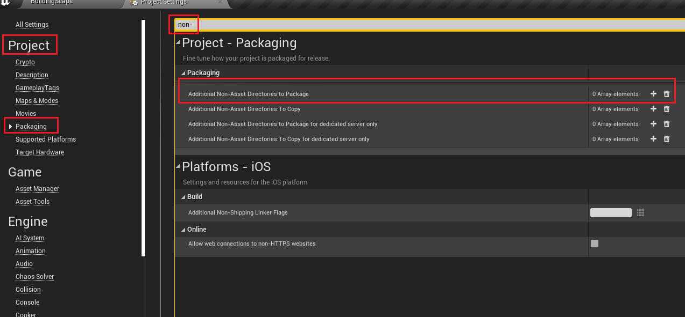

# Códigos úteis
## Angulo atual de um objeto dado x e y
```c++
float X = GetOwner()->GetActorForwardVector().X;
float Y = GetOwner()->GetActorForwardVector().Y;
float Hip = FMath::Sqrt(FMath::Pow(X, 2) + FMath::Pow(Y, 2));
float Sin = Y / Hip;
float Degree = FMath::RadiansToDegrees( FMath::Asin(Sin) );
if (Sin < 0)
{
  Degree = 180.f + (FMath::Abs(Degree));
}
```

## Carregando dados a partir de um arquivo
Em vez de aumentar massivamente os tempos de execução criando conteudo pode se mudar isso carregando dados diretamente de arquivos com o metodo `FFileHelper::LoadFileToStringArray`. O exemplo a seguir carrega uma lista de palavras em um array.
```c++
TArray<FString> Palavras;
const FString WordListPath = FPaths::ProjectContentDir() / TEXT("WordLists/HiddenWordList.txt");
FFileHelper::LoadFileToStringArray(Palavras, *WordListPath);
```
### Carregando dados com um criterio
Podemos usar o metodo anterior pra popular um array baseado em um criterio, apenas usando C++ e lambdas. `LoadFileToStringArrayWithPredicate` pode obter um argumento adicional na forma de função que recebe uma string e retorna um booleano. O exemplo a seguir adiciona ao array somente palavras que tenham menos de 10 caracteres dado o arquivo contendo os dados.
```c++
TArray<FString> Palavras;
const FString WordListPath = FPaths::ProjectContentDir() / TEXT("WordLists/HiddenWordList.txt");
FFileHelper::LoadFileToStringArrayWithPredicate(Palavras, *WordListPath, [](const FString& Word) { return Word.Len() < 10; });
```


### Packaging
Para que isso funcione em um jogo empacotado, você precisaria adicionar o diretório WordLists à lista de Diretórios Não-Ativos Adicionais para empacotar em suas Configurações do Projeto em Empacotamento. Alternativamente, você pode simplesmente usar a pesquisa.
<div align='center'>
  
</div>
